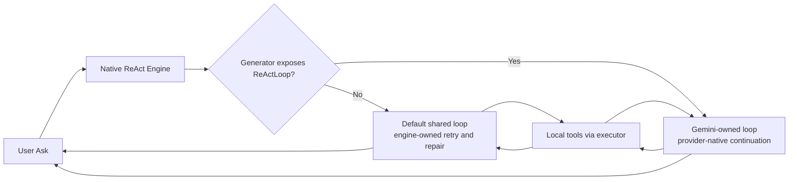
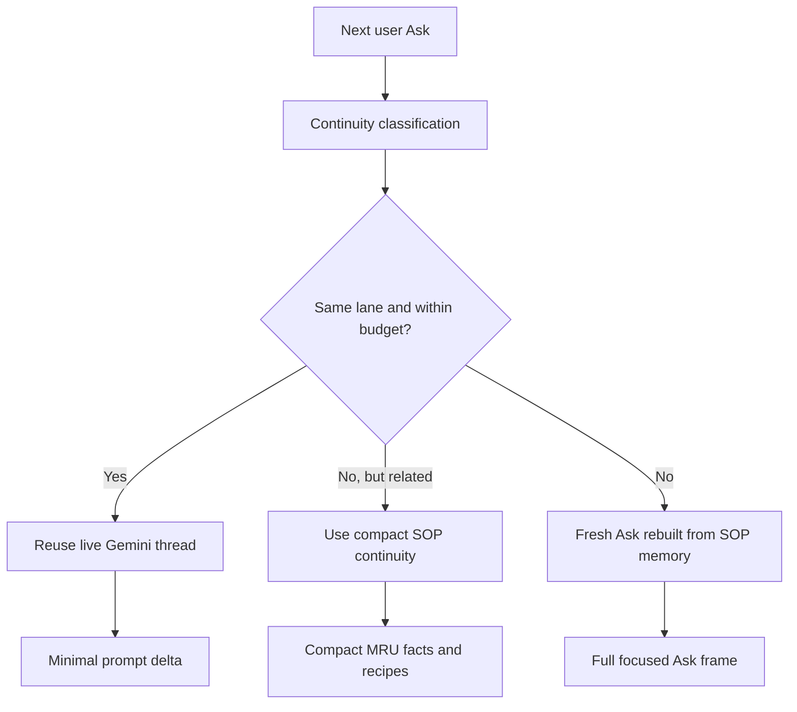
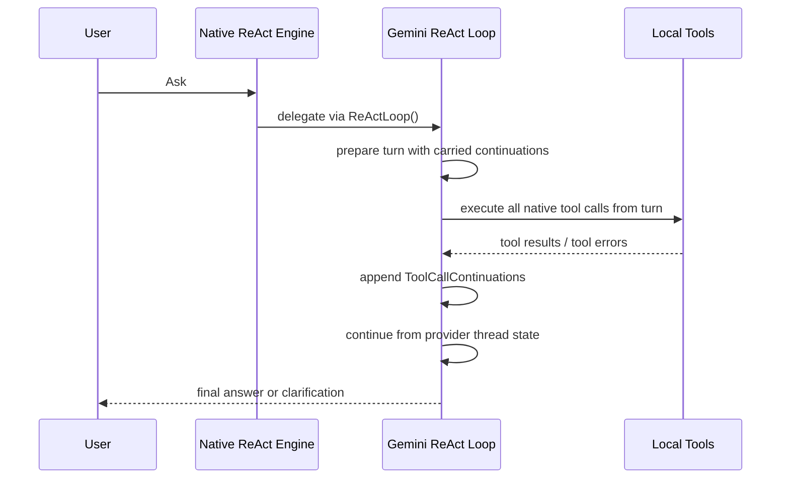

# Building a "Local Expert" AI: Embedding an Intelligent Copilot into SOP Data Manager

I'm excited to share a major update to the **SOP Data Manager**, the GUI tool for our Scalable Objects Persistence (SOP) engine. We've moved beyond simple CRUD operations and integrated a fully context-aware **AI Copilot** directly into the workflow.

This isn't just a chatbot overlay; it's a **ReAct (Reasoning + Acting) Agent** deeply integrated with the database backend, designed to act as a "Local Expert" for your data.

> **Important**: The AI Copilot requires an LLM API Key (e.g., Gemini, OpenAI) to function. You must provide your own key in the "Environment Configuration" settings. If no key is supplied, the AI Copilot features will be disabled.

### 🔌 New: "No-LLM" Production Mode
SOP recognizes that **Production Environments** often have strict security policies that forbid external API calls (Air-gapped) or require zero external dependencies.

We have introduced a **Direct Command Interface** that works entirely offline:
*   **Slash Commands**: You can bypass the LLM entirely by using slash commands (e.g., `/select database=users`).
*   **Zero Dependencies**: This mode requires NO internet connection and NO API Key.
*   **Full Power**: You get access to the exact same backend tools (`select`, `run_script`, `manage_knowledge`) that the Agent uses, but driven manually by you.

This confirms our philosophy: **The AI is a helper, but the robust machinery underneath is yours to command.**

## The Problem: Context Switching
Managing complex NoSQL data often involves jumping between a GUI to view items and a terminal to run queries or scripts. You might see a record, wonder "how many other records have this specific field value?", and have to switch context to write a script to find out.

## The Solution: A Floating, Context-Aware Copilot
We've refactored the UI to introduce a persistent, **floating AI widget**.
*   **Always Available**: It floats above your data grid, draggable and resizable, so you never lose sight of the data you're analyzing.
*   **Tool-Equipped**: The AI isn't hallucinating answers. It has access to real backend tools:
    *   `list_stores()`: To understand your database topology.
    *   `get_schema()`: To analyze the structure and index specifications of your B-Trees.
    *   `search()` & `select()`: To query data directly.
*   **Visual Feedback**: When the AI performs a search, it doesn't just tell you the results—it can trigger the main data grid to **refresh** and show you the actual records.

## The Paradigm Shift: Introducing "Agentic Data"
The problem with today's data is that it is too structured—too rigidly SQL (tabular) or too arbitrarily NoSQL (document-based). Traditional schemas force the user to organize data for the *database's* convenience. This makes it difficult for AI to manage, mine, and aggregate data accurately on behalf of the user.

We invented a new primitive: **Agentic Data**. 
Instead of forcing data into rigid columns, Agentic Data is auto-managed by the AI. It is stored semantically (via `Concept`, `Category`, and `Description` embeddings) inside dedicated **Playbooks (Knowledge Bases)**. 
- **AI-Native**: Because the data speaks the AI's language (natural language + embeddings), the LLM can seamlessly mine it, reason over it, and self-correct it without complex SQL joins.
- **Configurable Personas**: Each Playbook is imbued with "AI-ness". When creating a Playbook, users define a **System Prompt** and an **Embedder**, dictating exactly *how* the AI should manage and draw persona from that specific data pool.
- **UI Reflection**: In the SOP Data Manager, Agentic Data isn't displayed in a dense tabular grid like standard crud stores. It is rendered as a responsive Card UI, subtly reminding the user that this entity is an "AI Maintained" context module.

## Under the Hood: A Secure RAG Pipeline
We purposely designed a **Retrieval-Augmented Generation (RAG)** pipeline to address the critical security needs of database management.
1.  **Local Power, Global Intelligence**: The backend is built in **Go**, keeping the execution logic and data access strictly local.
2.  **Data Privacy & Filtration**: Your production data *never* leaves the environment. Only the prompt for interpretation and reasoning is sent to the LLM. The actual data retrieval and manipulation happen locally via the SOP library.
3.  **Policy Enforcement**: By decoupling the reasoning (LLM) from the execution (Local Tools), we can enforce strict policies on what the agent can and cannot do, removing the risks associated with giving an AI direct access to corporate data.
4.  **ReAct Loop**: The LLM reasons about which tool to use, but the Go backend intercepts these calls, validates them, and executes them safely using ACID transactions.

### Progressive ReAct Loop

The ReAct loop in SOP is progressive by design, not a blind repeat-until-success loop.

*   **Clarification First When Needed**: Before routing and execution, Gate 0 can now keep the interaction in a clarification-first mode. If the assistant asks a focused clarification question, the next user reply is rewritten back onto the original target ask and the normal execution path resumes.
*   **Macro Then Micro**: Routing gates prepare the Ask frame first. The inner native ReAct loop then executes inside that frame without re-running the gates on every retry.
*   **Ask-Anchored Working State**: After each inner tool step, the engine or provider-owned loop compacts the current grounded state into an Ask-local MRU summary. The next LLM call sees current focus, preserved valid work, confirmed facts, missing pieces, and suggested next tools.
*   **Structured Tool Guidance**: Tools can return both a user-visible payload and an internal `progress_hint`. That hint can say what improved, what is still missing, and which tool should come next.
*   **Concrete Retry Visibility**: The retry prompt now includes the actual generated tool arguments together with failure details and the most recent successful context, so the model can refine the next step from the improving script rather than regenerate the whole plan.
*   **Bounded Repair, Not Infinite Retry**: The loop starts with a small retry budget and only extends it when new grounded facts, a proven recovery pattern, or positive progress hints show real convergence.
*   **Recipe Learning Inside the Loop**: When a repair pattern succeeds, the engine learns an implicit recipe from that success. That recipe is not just stored for later asks; it also counts as live progress in the current Ask.
*   **Hard Stop Semantics**: Tools can explicitly signal terminal outcomes such as blocked, anti-success, or hard error. In those cases, the loop stops immediately instead of wasting retries.

In practical terms, this means a user can supplement or redirect a failed or incomplete Ask on the next turn without restating the whole task. Gate 0 carries the target ask forward, and the resumed Ask can continue into grounded research or tool execution once the model emits a native tool call.

In practical terms, this means SOP's ReAct loop can see the returned agent context, the script it already tried, the exact failure, the grounded facts it has accumulated, and the missing pieces that still need research. That is what allows the LLM to preserve what is already correct and refine only the next delta.

### Two First-Class Store Control Surfaces

As query reliability work has progressed, one design direction has become explicit: SOP must treat both of its store-control surfaces as first-class rather than assuming one universal tool shape fits every provider and model.

*   **Rich-plan surface: `execute_script`**. This remains the high-bandwidth option when the model can fluently emit one coherent multi-step workflow. It is still the best user experience for strong models because it compresses a complete plan into one tool call.
*   **Block-assembly surface: piped native lego blocks**. This is the lower-level control surface built from the same atomic operations that the engine already uses internally. Typical steps include `begin_tx`, `open_store`, `scan`, `filter`, `join_right`, `project`, `limit`, `commit_tx`, and `rollback_tx`.

These are not two different engines. `execute_script` is an orchestration envelope over the same underlying execution substrate. The lego blocks are the execution substrate made directly visible to the model.

This policy currently applies to **Stores workflows**. Spaces remain a separate domain centered on knowledge ingestion, enrichment, semantic retrieval, and user-managed memory operations through domain-native tools rather than store-style join/filter orchestration.

Why this matters:

*   Some models are fluent at emitting a complete script AST in one shot.
*   Some models are much more reliable when they can assemble the same workflow one grounded step at a time.
*   SOP therefore needs both surfaces well-oiled so the product stays reliable across providers and model quality levels.

Shared policy direction:

1.  Try `execute_script` first when the request looks like one coherent workflow.
2.  If the failure is recoverable through missing user facts or grounding, enter clarification/meta-talk, gather the missing detail, and retry `execute_script` with a richer grounded plan.
3.  If the workflow remains structurally unstable, the system should be able to continue in lego-block mode, where the model assembles smaller piped steps over the same transaction/result context.

For Spaces, the design direction is different: keep the domain-specific Space verbs first-class and evolve Stores-to-Spaces interoperability as a separate cross-domain orchestration seam rather than forcing Spaces into the same lego-block story prematurely.

This escalation policy is intentionally provider-neutral. Gemini, ChatGPT, Anthropic, and the generic engine path may transport turns differently, but the orchestration rule should stay the same.

### Current Provider Reality

The Ask/ReAct system now has an explicit provider-owned loop seam. The generic engine still exists, but providers that can genuinely carry their own volatile thread state can now own the inner loop directly instead of being forced through one shared retry controller.

*   **Gemini**: Now owns a native provider loop in `ai/generator/gemini.go`. The engine delegates to `ReActLoop()` when Gemini is selected. Gemini receives tool schemas, returns parsed native tool calls, accumulates full tool-call continuations across turns, and continues from provider-native function call/function response state instead of replaying a synthetic retry frame on each pass.
*   **Shared Ask Outcome Summaries**: MRU-facing `OutcomeFacts` and `OutcomeRecipes` now come from the shared helper in `ai/outcome_summary.go`. That keeps MRU continuity behavior aligned between the default engine path and provider-owned Gemini runs.
*   **OpenAI ChatGPT**: Now owns the default native provider loop in `ai/generator/chatgpt.go`. The engine delegates through the OpenAI Responses API, preserves `previous_response_id` when available, replays assistant/reasoning/tool items when provider response IDs are missing, executes native `function_call` items locally, and can stream assistant/tool/reasoning events through the shared request streamer. The old scaffold flag is now only an explicit opt-out if someone needs to force the generic path while debugging.
*   **Anthropic**: Also still currently follows the generic path in this codebase. It does not yet own a provider-native loop here.

Provider-neutral rule:

*   provider code should handle transport, continuation shape, and response parsing
*   shared Ask/ReAct policy should decide when to stay on `execute_script`, when to ask for clarification, and when to shift into lego-block assembly mode
*   no provider should require a different user-facing recovery model for the same Stores workflow

The operational consequence is that Gemini is no longer the old hybrid described in earlier drafts. Gemini is now the reference implementation of the thin-wrapper model in SOP:

*   the provider owns the live conversational/tool thread
*   the application owns tool execution, event wiring, and hard guardrails
*   the final clarification turn is an enforced hard stop with no tool schemas exposed

This design is now documented, and the next tracked implementation phase is:

Current stabilization order for release:

1.  **Queries**: Stabilize store research, joins, filters, script AST generation, tool repair, and provider-owned query execution loops first.
2.  **Spaces**: After Queries are reliable, stabilize Space lifecycle operations, enrichment, vectorization, and config mutations.
3.  **KB Searches**: Once Queries and Spaces are stable, harden Knowledge Base search grounding, retrieval ranking, and search-to-action handoff.
4.  **Memory Injection**: Only after those surfaces are stable should SOP make memory injection a dominant runtime layer for cross-Ask continuity.

That does not mean carryover or provider-owned continuity are out of scope for the current release iteration. Queries still depend on them materially, so they are being actively exercised, traced, and hardened now as part of query stabilization. The deferral is narrower: SOP is postponing memory injection as a dominant cross-Ask runtime layer until Queries, Spaces, and KB Searches are stable enough to sit on top of it.

In other words:

*   **Provider Loop and Carryover (Current Iteration)**: Provider-owned loops, bounded carryover, hydration, repair continuity, and cross-turn tool-call state are part of the active stabilization surface because query reliability depends on them.
*   **Memory Injection as Primary Runtime Layer (Deferred)**: Broader MRU/STM/LTM injection as the main cross-Ask reasoning substrate remains intentionally sequenced after Queries, Spaces, and KB Searches.

The next deeper memory-focused phase is still planned, but it is not the current release blocker:

*   **Budgeted Carryover Across Asks**: Bounded Gemini carryover between adjacent Asks remains a tracked implementation phase. The model should be allowed to reuse its live thread only while the topic, KB, provider, and token budget remain valid. Once that thread grows expensive or stale, SOP should cut over to compact MRU, `OutcomeFacts`, learned recipes, and focused retrieval instead of replaying the whole raw thread.

When SOP returns to memory injection hardening, that work should be treated as a reliability project rather than prompt tuning. The release gates for that phase are:

1.  **Continuity Gate**: MRU -> STM -> LTM handoff remains correct across normal asks, follow-ups, clarification turns, and provider-owned retries.
2.  **Grounding Gate**: Schema facts, relations, prior tool outcomes, and learned repair recipes survive between asks and are reused without reintroducing stale or contradictory facts.
3.  **Repair Gate**: Failed tool calls preserve enough ask-local truth for the next loop to repair the broken slice instead of restarting the whole task.
4.  **Observability Gate**: Hydration, carryover, and memory-projection paths are inspectable in logs and tests so provider drift can be debugged from evidence instead of guesswork.

That means SOP will deliberately treat provider carryover as a short-horizon cache rather than the primary memory layer:

*   live Gemini continuity when it is cheap and still on-topic
*   compact SOP memory when continuity is still useful but the provider thread is getting expensive
*   full SOP rebuild when the topic or trust boundary changed

Tracked carryover decision model:

Gemini-native turn model:

### LLM Provider Requirements

SOP AI integration requires specific capabilities from LLM providers to support the ReAct agent architecture, tool calling, and multi-turn conversations.

#### Supported Providers

**Current Integration Status:**

| Provider | Status | Implementation | Native Loop | Carryover Method |
|----------|--------|----------------|-------------|------------------|
| **Google Gemini** | ✅ Production | `ai/generator/gemini.go` | Provider-owned | ToolCallContinuations array |
| **OpenAI ChatGPT** | ✅ Production | `ai/generator/chatgpt_react_loop.go` | Provider-owned | Responses API threading (PreviousResponseID) |
| **Anthropic Claude** | ✅ Production | `ai/generator/anthropic.go` | Generic path | Message history with tool_use/tool_result blocks |
| **Ollama (Local)** | ❌ Not Supported | `ai/generator/ollama.go` | N/A | No tool calling support - **Embeddings only** |

#### Required Capabilities

All production LLM models in the catalog **must support** the following features:

1. **Tool Calling (Function Calling)** - **CRITICAL**
   - Must accept tool definitions with JSON schemas in requests
   - Must return structured `ToolCall` objects with function name and arguments
   - Used via: `GenOptions.Tools` → `GenOutput.ToolCalls`
   - Without this: Agent cannot execute database operations, queries, or scripts

2. **System Prompts** - **REQUIRED**
   - Must accept system-level instructions separate from user prompts
   - Used via: `GenOptions.SystemPrompt`
   - Purpose: Enforces role boundaries, task context, and behavioral constraints

3. **Multi-Turn Conversations with Tool Continuations** - **REQUIRED**
   - Must support conversation history with tool_use/tool_result pairs
   - Must preserve context across multiple reasoning-action cycles
   - Used via: `GenOptions.ToolCallContinuations` (provider-neutral format)
   - Without this: No carryover between ReAct loop iterations

#### Optional But Valuable

4. **Thinking/Reasoning Controls** (Gemini-specific)
   - Optional support for internal reasoning intensity control
   - Levels: `low` (strict structured outputs), `medium`, `high` (creative tasks)
   - Used via: `GenOptions.ThinkingLevel`

5. **Structured Output Schemas** (Gemini-specific)
   - Optional support for strict JSON schema enforcement
   - Constrains token generation to prevent hallucinated fields
   - Used via: `GenOptions.ResponseSchema`

#### Carryover Architecture

SOP uses a **two-level carryover system** for conversation continuity:

**Macro-Level (Inter-Ask Carryover):**
- Budget-based with limits: `AskCount`, `EstimatedCarryTokens`, `EstimatedRawToolTokens`
- Falls back to **compact mode** when budget exceeded
- Enriched with **MRU context** (store schemas, relations, confirmed facts, tool patterns)
- Managed by: `ai/agent/carryover.go`

**Micro-Level (Intra-ReAct Loop):**
- **Gemini**: Uses `ToolCallContinuations` array with full function call/response state
- **ChatGPT**: Uses `PreviousResponseID` via OpenAI Responses API threading
- **Claude**: Uses message history with `tool_use`/`tool_result` content blocks
- Provider-specific but abstracted through `ToolCallContinuation` interface

#### Model Selection Guidelines

When choosing models for the catalog (`model_catalog.json`):

- ✅ **Include**: Models with verified tool calling support and active API availability
- ✅ **Test**: Validate each model handles complex multi-step workflows reliably
- ❌ **Exclude**: Models without function calling support
- ❌ **Exclude**: Preview/experimental models not production-ready
- ⚠️ **Caution**: Future models should be verified against API documentation before adding

**Current Production Models:**
- **Gemini**: 3.5 Flash, 3.1 Pro Preview, 2.5 Pro, 1.5 Pro/Flash/Flash-8B, Gemma 4/4-IT
- **Claude**: 4.7 Opus/Sonnet/Haiku, 4.6 Sonnet/Haiku, Code Sonnet/Opus 4.6, 3.5 Sonnet/Haiku
- **GPT**: 4o, 4o-mini, 4-turbo, 3.5-turbo (and 5.x/o3-mini if available as of June 2026)

**Not Supported for LLM (Embeddings Only):**
- **Ollama**: Local models lack native tool calling support required for the ReAct agent architecture. Use Ollama for embeddings (nomic-embed-text, mxbai-embed-large, all-minilm) or for simple text-to-text transformation tasks that don't require database operations.

See `model_catalog.json` for the complete list with capability annotations.

### Two-Layer MRU Model

SOP now uses two distinct MRU layers that share the same live session buffer but serve different purposes:

*   **Inner Ask-Progress MRU**: A provisional, ask-scoped partition used only while a provider-owned loop is still running. Provider loops can emit bounded grounded updates through the shared `MemoryHydrationSink` contract in `ai/interfaces.go`. These updates are limited to grounded progress such as confirmed facts, recent tool pattern, final text so far, and carryover metadata. They are intentionally tagged as ask-scoped and are cleared at the start of each Ask and again during epilogue.
*   **Session / Carryover MRU**: The canonical between-Ask memory layer. At epilogue, SOP persists the final ask outcome into session-scoped MRU, snapshots that macro MRU into STM, merges learned recipes, and updates carryover metadata. When native provider carryover is unavailable or cut off, this session/STM-backed layer is what reconstructs continuity for the next Ask.

Hydration contract limits:

*   Provider-owned loops should normalize provisional updates through `ai.BuildMemoryHydrationUpdateFromParts` in `ai/memory_hydration.go`.
*   `ai.BuildMemoryHydrationUpdate` remains available as a thin adapter from a full `ReasoningResponse`, but new provider-owned loops should prefer the narrower `FromParts` helper.
*   The helper currently retains only the most recent 6 tool calls and 6 grounded facts.
*   Provisional final text and carryover summaries are trimmed to 600 characters.
*   Individual grounded facts are trimmed to 240 characters.
*   Carryover metadata is cloned and bounded as well, including recent tool names and outcome facts.

Operational rule:

*   provisional in-loop MRU may help the running Ask
*   final ask outcome always wins and becomes the only MRU layer promoted into STM carryover

### GPT / OpenAI Parity Model

The OpenAI/ChatGPT owned loop now follows the same two-layer state model already established for Gemini:

*   **Stateful inside the Ask loop**: provider-owned response/thread state remains local to the running Ask. It may emit bounded provisional hydration through `ai.BuildMemoryHydrationUpdateFromParts`, but it does not become canonical memory.
*   **Carryover between Asks**: provider-side continuation handles now flow through `CarryoverState` and may reuse OpenAI `previous_response_id` continuity when the thread is still valid. If that handle is unavailable, SOP falls back to replaying compact assistant/reasoning/tool history rather than treating vendor state as durable memory.
*   **Canonical continuity stays local**: if provider carryover expires, resets, or becomes too expensive, SOP reconstructs continuity from session MRU, STM snapshots, recipes, and LTM/playbooks rather than depending on vendor state.

Current completion status for this GPT phase:

*   the owned loop is now on by default for ChatGPT in this codebase
*   Gemini, ChatGPT, and the generic native engine now share one backend event contract in `ai/stream_events.go`
*   focused GPT generator tests and the full `cd /Volumes/BigDrive/sop/ai && go test ./...` suite were green at the end of this phase
*   the remaining GPT follow-up is not architecture work; it is a live-key smoke test against the real OpenAI API if operational verification is desired later

Design rule:

*   treat provider server-side state as a short-horizon runtime optimization
*   keep epilogue as the only promotion point into canonical between-Ask memory
*   keep streamed provider events observational only; they inform UI/runtime progress but do not replace final epilogue promotion

### Dynamic Tool Registration Boundary

The correct architectural seam is between:

1.  **Stage 1: Focused retrieval / schema grounding**
2.  **Stage 2: Inner Ask/ReAct execution**

Today SOP already narrows the prompt heavily through routing, focused context, and recipes. However, the tool contract itself is still broader than ideal. The next refinement is to let focused retrieval not only narrow prompt text, but also narrow the tool registration payload handed to the provider so the LLM reasons inside a smaller, grounded schema sandbox before the loop starts.

This matters because dynamic tool registration:

*   keeps token pressure lower than replaying broad schema text in every retry frame
*   reduces guessed tables, fields, and join mappings
*   gives runtime validation a smaller and more accurate contract to enforce

## Why This Matters
This architecture allows us to create a **fully controllable, customizable AI** necessary for enterprise databases.
*   **Agentic Interfaces**: We build a robust set of tools and give an AI agent the agency to use them, but within a secure sandbox.
*   **For Developers**: You get a natural language interface to your raw data. "Show me the top 5 users created yesterday" translates automatically to a B-Tree range query.
*   **For Operations**: Troubleshooting becomes conversational. "Why is this store empty?" prompts the AI to check schemas and transaction logs.

## Natural Language Programming: The "Lego Blocks" Evolution
We've taken this a step further with our **Script System**, evolving it into a robust scripting engine built on "Atomic Lego Blocks."

Instead of asking an LLM to generate raw, potentially unsafe code (which is hard to debug and secure), we use a **Compiler Approach**:
1.  **Intent Extraction**: The LLM analyzes your request (e.g., "Find users older than 25 who haven't logged in for a month").
2.  **Block Assembly**: It assembles a script using our pre-built, high-performance atomic functions (the "Lego Blocks").
    *   **`compare(val1, val2)`**: A universal comparator handling strings, numbers, and dates seamlessly.

## The AI Enablers: How We Broke the "Complexity Ceiling"

Many organizations fail to adopt AI for core operations because they hit a "wall" of unreliability or technical debt. We built specific architectural features—our "Moat"—to bypass these limits.

### 1. "Lazy to Strict" Automatic Refinement
LLMs yield volatile code. One day they write verbose scripts; the next, they skip variable declarations.
*   **The Problem**: If you store the "lazy" code generated by an AI, your system becomes fragile and unreadable. Implicit assumptions break over time.
*   **Our Solution**: We allow the AI to be "lazy" during creation, but we **automatically refine** the script into "strict" mode before saving it.
    *   Implicit `begin_tx` becomes `{"result_var": "tx"}`.
    *   Implicit wiring (`open_store`) gets explicit dependencies (`"transaction": "tx"`).
*   **Benefit**: You get the speed of AI generation with the stability of handwritten, strictly-typed code.

### 2. Runtime Context & Safety Nets
Scripts often fail because context (like "which transaction is active?") is lost between steps.
*   **Our Solution**: The execution engine maintains a "Context Stickiness" layer. If a step requires a transaction but none is provided, the engine intelligently resolves the safest active context.
*   **Benefit**: Scripts are robust against minor syntax errors or "forgetful" AI models.

### 3. Self-Correcting Knowledge Base (Evolution to Omni Protocol)
Most AI tools reset their memory after every session or depend on heavily loaded monolithic system prompts that bloat context. In our V1 architecture, we introduced `manage_knowledge` to store rules persistently.
*   **Our Solution (V2)**: SOP uses the Butler Architecture. Knowledge constraints and vocabulary are embedded in dynamic Vector spaces (e.g. SOP KB) derived natively from markdown. When the agent plans execution, "The Butler" fetches precise contextual nodes. 
*   **Benefit**: The system naturally self-corrects its trajectory based on current architectural instructions without manual prompt rewiring or bulky prompt pollution, remaining lightweight and highly tailored per-query.

---

## Technical Appendix: Configuration
(This section remains unchanged...)
    *   **`matchesMap(item, criteria)`**: A MongoDB-style query evaluator supporting operators like `$gt`, `$lt`, `$in`, and `$eq`.
    *   **`toFloat(val)`**: Robust type conversion for numerical analysis.
    *   **`Scan(store, options)`**: High-performance B-Tree traversal (Range, Prefix, Forward/Backward).
    *   **`JoinRightCursor(left, right, key)`**: Optimized Right Outer Join iterator.
3.  **Safe Execution**: These blocks are compiled into a SOP Script that runs on the bare-metal Go engine.

### Why "Lego Blocks"?
*   **Agility & Control**: We can tweak the underlying implementation of a block (e.g., optimizing `compare` for speed) without changing the AI's behavior.
*   **Safety**: The AI cannot "hallucinate" dangerous code. It can only arrange the safe blocks we provide.
*   **Performance**: The resulting scripts run at native Go speeds, not interpreted Python/JS speeds.
*   **Streaming & Efficiency**: Results are streamed directly to the UI or REST client. This allows processing **SQL Joins on huge B-Trees with minimal memory**, as we never load the full dataset into RAM.

*   **SystemDB**: These scripts are stored in a dedicated B-Tree, effectively turning your database into a programmable application server.

## Next Steps
We are expanding the toolset to include **Vector Search** capabilities, allowing you to perform semantic queries ("Find documents related to 'scalability'") right from the same floating window.

Check out the code and try running it locally with Ollama!

#Golang #AI #LLM #Database #SOP #OpenSource #AgenticUI #ReAct

## Future ETL Iteration: CLI/Headless AI Streaming
In addition to the interactive UI (where a user copy/pastes a sample, visually previews the transformed data, and uses an embedded mapping script to onboard data into SOP), we plan to expose an API endpoint for background streaming:
1. **Background Streaming (No-UI):** Allows users to pass a large CSV/JSON file to SOP programmatically over a CLI/REST API.
2. **Headless Execution:** The system uses the previously generated mapping script (generated by the AI Copilot and saved during the interactive UI session) to rapidly convert data object-by-object in the background.
3. **Data Quality Fallback:** If the structural rules established by the script fail for certain records, those raw records can be pushed to a queue for "AI-in-the-loop" slow-fallback mapping, preventing the streaming job from failing completely on dirty data.

## The Multi-KB Omni Pipeline & Custom Personas

A major architectural advancement in SOP's AI is the **Multi-KB Omni Pipeline**. Because SOP allows you to build multiple domain-specific Knowledge Bases (e.g., HR Policies, Medical Legal, Engineering Docs), sending all of them to the LLM at once would cause context collapse and hallucination. 

To solve this, the Copilot uses an intelligent cognitive routing system:

1. **Contextual Classification:** When you ask a question, the AI first analyzes your Ask + Short-Term Memory to determine *which* Knowledge Base is most relevant.
2. **Dynamic Rule Adoption:** If the relevant KB has a **Custom Persona / System Prompt** configured, the AI will *read that prompt first* before executing any searches. 

### Writing Effective Space Personas
When you create or edit a Space (Knowledge Base) in the UI, you can enable **"Use as Persona (Agentic Context)"** and provide a System Prompt. This is your opportunity to program *how* the AI should handle this specific data silo.

**Best Practices for Space Personas:**
- **Don't just say what it is; say HOW to use it:** Instead of "You are a legal bot," say: *"You are a Legal compliance auditor. When searching this KB, always cross-reference terms and cite the exact clause."*
- **Use the '✨ Enhance with AI' Button:** If you only have a rough idea, click the **✨ Enhance with AI** button. Our backend will expand your draft into robust instructions optimized for the Omni Pipeline!

### The Two Modalities of the AI Copilot
SOP provides two distinct paradigms for deploying the AI Copilot:

**Type 1: The Orchestrator (Meta-Agent / Omni-Persona)**
This is the default mode for administrators and platform engineers.
* **How it works:** The LLM retains its core identity as the "SOP Master Architect" routing manager.
* **Best For:** Complex multi-domain orchestration, DB management, and Swarm computing design.

**Type 2: Target Identification / Avatar Mode (Exclusive Content Immersion)**
This mode is designed for deploying end-user sandboxes.
* **How it works:** The LLM does NOT suppress the `OMNI_PERSONA`. Instead, Omni acts as the invisible governing orchestrator. When an Ask routes to an Avatar KB, Omni "hands off" execution—injecting the Avatar's System Prompt and exclusively running the execution slice using the Avatar's constraints and domain logic.
* **Best For:** Deploying a strictly compliant Medical Advisor or Legal Auditor where the end-user should not interact with technical backend tools, but the backend still requires SOP's architectural governance.

### 🎮 The "Game Engine vs. Interactive Character" Analogy
To understand this architecture, game designers will recognize a familiar paradigm. The SOP AI functions exactly like a modern RPG simulation engine.

- **The Game Engine (Omni Persona):** Omni acts as the invisible backend supervisor. It handles the routing, memory allocation, context switching, safety rails, and data pipelines. The user never "talks" to the engine directly when playing the game.
- **The Interactive Character (Avatar Persona):** The Avatar is the immersive 3D character or environment the user interacts with in real-time. Because of SOP's partitioned memory spaces, this character maintains its own distinct continuity, dialog history, and personality.

This decoupling allows developers to hot-swap "Avatars" (Knowledge Bases/Playbooks) while the "Game Engine" (Omni) safely manages the core infrastructure and memory isolation in the background.

### The Mechanics of Avatar Continuity (Stateless Immersion)
From an infrastructure perspective, **Avatar Mode is stateless per request.** 
When a user chats with "The Doctor" KB, it works like this:
1. **The Ask:** The user sends a prompt.
2. **The Omni Wrapper (Governance):** The Omni-Protocol wakes up in the backend, remaining the foundational system prompt, to perform safety checks and semantic routing. 
3. **The Sandbox Handoff:** Once detected, the system branches the execution slice into Avatar Mode. Omni natively reads the Avatar's System Prompt and strictly boundaries its queries and limits for that interaction.
4. **The Illusion of Continuity:** Under the hood, memory structures (STM and LTM) natively partition and tag their payloads based on the Avatar context, meaning the automated SOP memory flows run identically to normal, just in a sandboxed lane.

### Avatar Boundary Protocol (LTM Partitioning)
To ensure total semantic isolation between avatars (e.g., preventing personal medical facts from leaking into an Engineering context), SOP implements the **Avatar Boundary Protocol**:

1. **Transcript Tagging (The State Ledger):**
   Every message exchange inside the Short Term Memory (STM) array includes a `AvatarScope` or `KBContextID` metadata tag. This lets the backend know which sandbox the conversation occurred within.
2. **Partitioned LTM Storage (Memory Sandboxing):**
   During the Omni "Sleep Cycle" (when the background agent extracts long-term facts), memories are deposited into **partitioned subspaces** in the VectorDB. Instead of writing to a generic `LTM_Space_{UserID}`, facts are written explicitly to `LTM_Space_{UserID}_Avatar_{KBID}`. 
3. **Contextual Sleep Cycle Injection:**
   When reviewing a tagged transcript, the summarization payload receives a dynamic compliance injection: *"You are reviewing a transcript that occurred within the restricted [Avatar] Sandbox. Focus extractions and send them explicitly to its partition."* This allows highly-relevant, isolated retrieval without cross-contamination.

### Knowledge Base Auto-Enrichment (Implicit vs. Explicit)
A core capability of SOP's AI pipeline is treating Knowledge Bases (KBs) not just as read-only silos, but as living, evolving data structures. However, to prevent curated "Master Manuals" (like official SOP or HR handbooks) from being polluted by user hallucinations or transient scratchpad thoughts, we enforce a strict **Implicit vs. Explicit Enrichment Strategy** governed by Role-Based Access Control (RBAC).

#### 1. The Configuration Flag (`AllowAutoEnrichment`)
Every Space (Knowledge Base) configuration now includes an `AllowAutoEnrichment` boolean flag.
* **`false` (Curated / Textbook Mode):** This is the default. The LLM treats the KB as a strict textbook. It will only write to this KB if the user *explicitly* commands it via prompt (and if the user has correct RBAC write permissions).
* **`true` (Dynamic / Sandbox Mode):** The LLM treats the KB as a collaborative workspace. It actively builds upon the base knowledge dynamically.

#### 2. Implicit Enrichment Pipeline (The Sleep Cycle)
When `AllowAutoEnrichment` is actively enabled for a KB, the background memory worker (`active_memory.go`) invokes the Space's natively built `TriggerSleepCycle(ctx)`. This kicks off a sophisticated data transformation pipeline to convert episodic user interactions into structured, semantically queryable Long-Term Memory:
1. **Summarization (`GenerateSummaries`)**: Raw `[]Thought` episodic data is fed into the LLM with a targeted prompt to decompose the stream into distinct logical vectors and standalone factual observations.
2. **Vectorization**: Extracted facts are embedded into mathematical float vectors (`EmbedTexts`).
3. **Mathematical Clustering (`MaxMathCategoryDistance`)**: Before defaulting to expensive LLM logic to classify facts, SOP utilizes blazing-fast local Cosine Distance mathematics to determine if the new vector perfectly aligns with an existing `CenterVector` taxonomic boundary.
4. **Fallback Formative Cataloging (`GenerateCategories`)**: If facts are "orphaned" by mathematical distance, they are batched to the LLM taxonomy organizer. The LLM evaluates the batch, incorporating the `PersonaContext`, and actively assigns (or generates) formal category labels.
5. **Schema Stabilization**: Center Vectors and `VectorHash` boundaries are recalculating, organically solidifying the Space matrix for future querying.

#### 3. Future Direction: Knowledge Base Absorption into LTM
Beyond implicit enrichment, SOP's long-term direction is to allow a Knowledge Base to be absorbed into Long-Term Memory as distilled expertise.
* **Current Default:** Right now, the practical model is still Avatar + KB + STM + LTM. The mounted KB is the active grounding surface for the LLM, and the product needs to keep stabilizing how that helps before we reduce dependence on live KB attachment.
* **Goal:** Let the AI accumulate multiple durable skills from curated Spaces, effectively creating a reusable internal depot of expertise.
* **Method:** Absorption should summarize and refine a Space into durable thoughts, rules, and skill fragments rather than naively copying the entire Space into prompt-time working memory.
* **Benefit:** The AI can become multi-talented over time while still respecting routing, prompt budgets, and isolation boundaries.
* **Constraint:** Absorbed knowledge must retain lineage to the source Knowledge Base so it can be refreshed, governed, or removed later if the source changes.
* **Operating-Model Shift:** If absorption matures, the system can evolve from an Avatar that is primarily defined by one mounted KB into an Avatar that carries its own STM/LTM plus previously absorbed expertise, then later absorbs additional KBs as new skills.

### Episodic Working Memory (Context Carry-over)

One of the great challenges of interacting with LLMs is the tendency to lose vital execution context—or "skills"—between prompts. Often called "Context Collapse", an LLM might successfully use a database grammar or a complex prompt instruction in turn one, only to forget those precise rules in turn two, requiring the user to re-prompt. 

The traditional solution is to inject those rules heavily into the root system prompt, causing prompt-bloat and high token costs.

We bypassed this by structuring memory deeply into **Episodes (Interactions).** 

*   **The Problem:** Hardcoding static tool grammar (like AST parameters) into a fixed global context means the agent becomes overly-specialized to one domain. Continual token injection ruins flexibility, particularly when handling multiple custom Avatar KBs.
*   **The SOP Architecture Solution (Dynamic Semantic Injection):** Working Memory (`sess.MRU`) is decoupled from Long-Term and Short-Term structures. We have eliminated all hardcoded parser instructions from the Go backend. Instead, the backend engine evaluates the *Metadata of the Previous Interaction* and natively searches the exact Semantic Knowledge Base chunk corresponding to the execution sequence.
    *   If a user continues a domain-specific conversation that utilizes the same Avatar or the same Knowledge Base (Space), and the prompt is too bare to retrieve new context chunks, the system automatically pulls the `Carried-Over Playbook Context` from the immediate prior interaction.
    *   **The Result:** Completely agnostic capabilities. By actively fetching boundaries and domain-rules natively from RAG rather than Go-binary strings, the AI seamlessly "remembers" its temporary working skills (like AST format constraints) dynamically, without permanently token-bloating the global system or sacrificing framework agnosticism.

## Advanced RAG: Decoupled Document Contexts (Document Mode)
SOP Knowledge Bases natively support an advanced **Document Mode**, significantly improving search quality and Retrieval-Augmented Generation (RAG) capabilities.

Instead of bloating indexes with massive payloads, Knowledge Bases decouple the semantic mapping from the canonical text:
*   **Many-to-One Relationships:** Multiple Categories and distinct Indexes (represented as Items' Summaries vectors) can securely reference the exact same canonical `Document`.
*   **High-Quality Search Hits:** By vectorizing specific, highly-distinct summaries or contextual chunks that point back to a single overarching source document, searches become hyper-focused. This design guarantees higher quality hits without losing the broader source context during generation.
*   **Untampered Source Delivery:** Because the raw reference points to the full document, it allows the LLM to ingest and share the source document exactly as is, completely untampered, without requiring complex and often inaccurate reassembly of fragmented bits and pieces.

## The Cascading Router Architecture
Moving beyond simple pure-LLM classifications or expensive K-Means VectorDB routing, the Copilot has evolved to use a highly deterministic, resource-efficient **Cascading Router**. When interacting through the AI, the query navigates through up to four specialized phases:

1. **Explicit Prefix Match (O(1))**: A constant-time check assessing whether the prompt prefixes match any defined `RoutingPrefix` configuration within the available Domain/Persona Playbooks.
2. **Global MRU Momentum Match (O(N))**: Scans the most recent conversation threads (Most Recently Used). If consecutive exchanges resolve to the same Avatar/Knowledge Base, the Copilot assumes that context and routing remains locked—avoiding unnecessary LLM overhead.
3. **Domain Reference Centroid Match (Vector Math)**: The query vector is mapped against localized, pre-calculated `DomainReference` target vectors specific to each Knowledge Base using Cosine Similarity thresholds.
4. **LLM Fallback (Heuristic Tiebreaker)**: Only defaults into LLM reasoning if the query fails to hit any of the deterministic thresholds or explicit patterns above. 

This Cascading strategy eliminates reliance on unstructured indexes and ensures extreme low-latency when determining user intent, acting purely as an ultra-fast structural heuristic rather than an unpredictably expensive LLM router.
