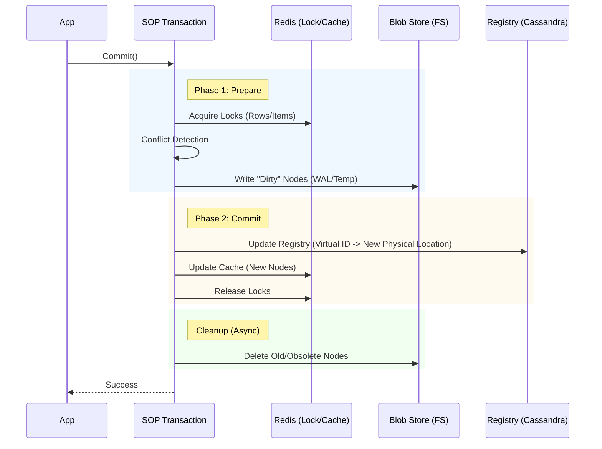

# SOP Architecture Guide

This document outlines the high-level architecture of the Scalable Objects Persistence (SOP) library, focusing on the package structure and the design decisions behind public vs. internal components.

## Package Structure & Visibility

SOP follows a strict separation between public APIs and internal implementation details to ensure a stable and safe developer experience.

### Project Structure

Here is an overview of the project's folder structure to help you navigate the codebase:

```text
sop/
├── adapters/          # Interface adapters (Redis, Cassandra)
├── ai/                # AI/Vector database modules & Python bindings
├── bindings/          # Cross-language bindings (Python)
├── btree/             # Core B-Tree data structure implementation
├── cache/             # Caching interfaces and implementations
├── database/          # High-level Database API (Entry point)
├── fs/                # Filesystem registry & I/O
├── incfs/             # Hybrid backend (Cassandra + Filesystem)
├── infs/              # Standard backend (Filesystem only)
├── inmemory/          # In-memory backend for standalone mode
├── internal/          # Internal implementation details (hidden)
├── jsondb/            # JSON document store
├── restapi/           # REST API server example
├── search/            # Search engine implementation (BM25)
└── streamingdata/     # Large object (BLOB) streaming support
```

### Public Packages

These packages are intended for direct use by consumers of the library:

*   **`github.com/sharedcode/sop/infs`**: The **primary and recommended** backend. It uses the local filesystem for both metadata (via a high-performance hashmap) and data. Redis is used strictly for **caching and coordination** (locking), not for data persistence.
    *   *Usage*: Ideal for both **distributed clusters** and single-node deployments. It outperforms the hybrid backend in stress tests.

*   **`github.com/sharedcode/sop/incfs`**: The "Hybrid" backend. It combines:
    *   **Cassandra**: For metadata and registry storage.
    *   **Filesystem**: For raw data storage.
    *   **Redis**: For caching and coordination.
    *   *Usage*: Use this if you have a specific requirement for Cassandra-based metadata management.

### Internal Packages

*   **`github.com/sharedcode/sop/internal/inredck`**:
    *   **Role**: This package contains the core implementation logic for the Redis/Cassandra interaction, specifically the "Cassandra Blob" pattern.
    *   **Why Internal?**: The pattern of storing B-Tree nodes as blobs in Cassandra is a powerful but complex implementation detail. Exposing this directly would risk users creating dependencies on internal storage formats or misusing the low-level blob management APIs. By keeping it internal, we enforce the use of the safe, transactional APIs provided by `incfs` and `streamingdata`.

## Design Principles

1.  **Encapsulation**: Complex storage logic (like the `inredck` blob management) is hidden behind clean, high-level interfaces (`incfs`).
2.  **ACID Transactions**: All public operations are designed to participate in SOP's Two-Phase Commit (2PC) transaction model.
3.  **Pluggable Backends**: The architecture supports different backend implementations (`infs` vs `incfs`) sharing common interfaces where possible.

## Development Guidelines

*   **Modifying Internal Packages**: If you are contributing to `internal/inredck`, be aware that changes here can affect both `incfs` and `streamingdata`. Always run the full integration test suite (`SOP_RUN_INCFS_IT=1`) after modifications.
*   **New Features**: New public features should generally be exposed via `incfs` or `streamingdata`, delegating to internal packages for the heavy lifting.

## Component Interaction & Backends

SOP supports two primary backends, each with a distinct architecture for handling metadata and data.

### 1. Filesystem Backend (`infs`) - **Recommended**

Designed for **distributed, high-scale environments** as well as single-node deployments.

*   **Structure**:
    *   The SOP database resides in the file system.
    *   Each **storage path** parameter provided during initialization corresponds to a **database folder**.
    *   Users can manage **many stores** (B-Trees) within each database folder.
    *   You can have **many database folders**, allowing you to create a vast set of databases, each dedicated to a specific taxonomy or domain.
*   **Registry (Filesystem)**: Stores metadata and the registry in a specialized, memory-mapped hashmap file on disk.
    *   *Why*: **Superior Performance**. The proprietary registry hashmap on disk, combined with Redis coordination, has been proven to scale better than the Hybrid Cassandra model. In stress tests simulating heavy workloads across machines on commodity hardware, `infs` performed **25% faster** than `incfs`.
    *   *Partitioning*: The registry is split into "Segment Files" (default 1MB) to manage concurrency and file sizes. See [Configuration Guide](CONFIGURATION.md#registry-partitioning--tuning) for tuning details.
*   **Blob Store (Filesystem)**: Stores nodes/values as blobs.
*   **Locking & Caching**:
    *   **Redis (Default)**: Uses Redis for distributed locking and caching.
    *   **In-Memory (Standalone)**: Can be configured to use internal memory for locking and caching, removing the Redis dependency entirely.

### 2. Hybrid Backend (`incfs`)

An alternative backend for distributed environments that **"Powers up"** your existing Cassandra infrastructure.

*   **Structure**:
    *   The SOP database metadata resides in Cassandra tables.
    *   Each **Keyspace** provided during initialization corresponds to a **logical database**.
    *   Users can manage **many stores** (B-Trees) within each Keyspace.
    *   You can have **many Keyspaces**, allowing you to create a vast set of databases, each dedicated to a specific taxonomy or domain.
*   **Registry (Cassandra)**: Stores metadata, B-Tree root information, and the "Virtual ID" registry.
    *   *Why*: **"Power up"** for Cassandra. This backend layers SOP's **ACID transactions** and **B-Tree indexing** (ordered data, range queries) on top of Cassandra, giving you the best of both worlds: Cassandra's robust replication for metadata and SOP's transactional consistency.
*   **Blob Store (Filesystem)**: Stores the actual B-Tree nodes and data values as serialized blobs.
    *   *Why*: Direct filesystem I/O is extremely fast and cost-effective for bulk data.
*   **Locking & Caching (Redis)**: Handles distributed locking and caches frequently accessed nodes.

### Transaction Data Flow

The flow of data during a **Commit** operation is similar for both backends, but the **Commit Point**—the moment the transaction becomes durable—differs.

#### `inredcfs` (Hybrid) Flow



#### `infs` (Filesystem) Flow

The flow is identical to the above, except **Cassandra** is replaced by the **Filesystem Registry**.

1.  **Prepare**: Nodes are written to the Blob Store.
2.  **Commit**: The Registry file on disk is atomically updated (via `fsync`) to point to the new node locations.
3.  **Cleanup**: Old blobs are removed.

### Key Concepts

*   **Virtual IDs**: Every item and node in SOP is identified by a UUID. The Registry maps this UUID to its current physical location (e.g., a file path or blob ID). This allows us to move data (Copy-On-Write) without breaking references.
*   **Metadata-Carrying Keys**: SOP allows complex structs to be used as B-Tree keys. This enables the Key to act as a "Covering Index," storing essential state (like `Version`, `Deleted` flags, or `CentroidID`) directly in the B-Tree node. This allows structural operations to be performed by scanning Keys only, avoiding the I/O cost of fetching large Data Blobs (Values).
*   **Two-Phase Commit & The "Commit Point"**:
    *   **`inredcfs`**: The commit point is the atomic update of the Registry in **Cassandra**. Once the registry row is updated to point to the new blob location, the transaction is durable.
    *   **`infs`**: The commit point is the atomic update of the Registry hashmap on the **Filesystem**.
*   **Registry as the Source of Truth**: The Registry is the primary provider and assurer of ACID properties (Isolation, Atomicity).
    *   **Temporary Artifacts**: B-Tree nodes and data pages modified in a transaction are considered **temporary** until their handles are fully written to the Registry during the commit phase.
    *   **Lazy Cleanup**: Because these artifacts are not "live" until registered, their cleanup (garbage collection) can be performed at a "luxury of time" pace (defaulting to a 4-hour interval), reducing system overhead without compromising data integrity.

## Deployment Modes

SOP is designed to run in two distinct modes, catering to different scale requirements.

### 1. Filesystem Backend (`infs`) - **Recommended**
*   **Backend**: `infs`.
*   **Architecture**: Multiple application nodes, shared storage (Network FS/S3). Redis is used for **coordination only**.
*   **Use Case**: Enterprise applications, high-availability services, distributed clusters.
*   **Pros**: **Highest performance** (25% faster than hybrid), horizontal scalability, fault tolerance, ACID guarantees.

### 2. Hybrid Mode (Distributed)
*   **Backend**: `incfs`.
*   **Architecture**: Multiple application nodes, shared storage (Cassandra + Network FS/S3).
*   **Use Case**: Environments with existing Cassandra infrastructure.
*   **Pros**: **"Powers up"** Cassandra with ACID transactions and B-Tree indexing. Horizontal scalability, fault tolerance.

### 3. Standalone Mode (Embedded)
*   **Backend**: `infs` (or `inmemory` for pure RAM).
*   **Architecture**: Single process, local storage.
*   **Use Case**: Desktop apps, CLI tools, local AI vector stores.
*   **Pros**: Zero external dependencies, maximum single-node performance.

## Backend Comparison: Isolation & Concurrency

When choosing a backend, it is crucial to understand how they handle isolation, locking, and multi-tenancy. Both backends support high concurrency, but their locking scopes differ.

| Feature | **FileSystem (`infs`)** | **Cassandra (`incfs`)** |
| :--- | :--- | :--- |
| **Primary Use Case** | High-performance distributed or local clusters. | Environments with existing Cassandra infrastructure. |
| **Multi-Tenancy** | **Directory-Based**: Each database is a separate folder on disk. | **Keyspace-Based**: Each database is a separate Keyspace in Cassandra. |
| **Locking Scope** | **`BaseFolder:StoreName`**<br>Locks are isolated to the specific database folder. Two stores with the same name in different folders *do not* block each other. | **`Keyspace:StoreName`**<br>Locks are isolated to the specific Keyspace. Two stores with the same name in different keyspaces *do not* block each other. |
| **Concurrency** | **High**. Operations on different databases (folders) are completely independent. | **High**. Operations on different keyspaces are completely independent. |
| **Metadata Storage** | Custom high-performance Hash Map on disk. | Cassandra Tables (`store`, `registry`, etc.). |
| **Data Storage** | Filesystem Blobs. | Filesystem Blobs. |
| **Coordination** | Redis (Distributed) or In-Memory (Standalone). | Redis. |

### Isolation & Locking Details

SOP uses **Redis** (in distributed mode) to manage transaction locks. The key design principle is that **locking is scoped to the logical database**.

*   **FileSystem Backend**: The "Logical Database" is defined by the `StorePath` (the folder path).
    *   *Example*: If you have `db1/users` and `db2/users`, a transaction on `db1/users` acquires a lock on `db1:users`. It will **never** block a transaction on `db2/users`.
*   **Cassandra Backend**: The "Logical Database" is defined by the `Keyspace`.
    *   *Example*: If you have `keyspaceA.users` and `keyspaceB.users`, a transaction on `keyspaceA` acquires a lock on `keyspaceA:users`. It will **never** block `keyspaceB`.

This architecture ensures that SOP can host thousands of independent databases (tenants) on the same infrastructure without lock contention between them.

## Reliability & Self-Healing

SOP incorporates advanced mechanisms to ensure data integrity and system stability, particularly in distributed environments where infrastructure components like Redis may restart or fail.

### Redis Restart Detection (Clustered Mode)

In Clustered mode, SOP relies on Redis for transaction locking and coordination. A Redis restart could potentially lose volatile lock information, leaving transactions in an indeterminate state. To mitigate this, SOP implements a **"Not Restarted" Token** mechanism:

1.  **The Token**: A special volatile key (`notrestarted`) is maintained in Redis with a sliding expiration (TTL).
2.  **Detection**: The background servicer (`onIdle`) periodically checks for this token.
    *   **Presence**: If the token exists, Redis is stable.
    *   **Absence**: If the token is missing (e.g., after a restart), the system infers a potential restart event.
3.  **Action**: Upon detecting a restart, the system triggers a **Lock Resurrection** process. It scans for incomplete transactions (via Priority Logs) and re-acquires the necessary locks to allow those transactions to either complete or roll back safely.

### Transaction Lifecycle Management

*   **Clustered Mode**: The background servicer continuously monitors for "dead" transactions and Redis restarts, ensuring that locks are restored and incomplete transactions are resolved without corrupting the registry.
*   **Standalone Mode**: Since there is no external Redis dependency, the application performs a comprehensive **Priority Rollback Sweep** immediately upon startup. This cleans up any transactions that were interrupted by a previous application crash.

This multi-layered approach ensures that SOP databases remain "rock solid" and self-healing, minimizing the need for manual administrative intervention.


