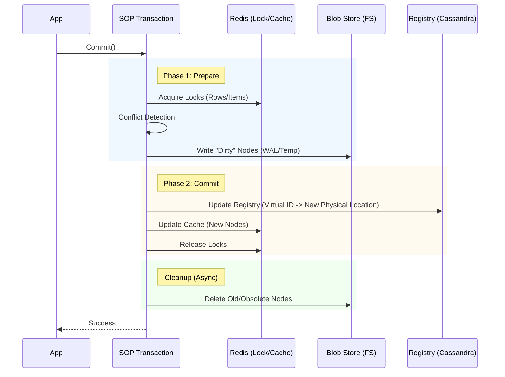

# SOP Architecture Guide

This document outlines the high-level architecture of the Scalable Objects Persistence (SOP) library, focusing on the package structure and the design decisions behind public vs. internal components.

## Package Structure & Visibility

SOP follows a strict separation between public APIs and internal implementation details to ensure a stable and safe developer experience.

### Public Packages

These packages are intended for direct use by consumers of the library:

*   **`github.com/sharedcode/sop/inredfs`**: The **primary and recommended** backend. It uses the local filesystem for both metadata (via a high-performance hashmap) and data, with Redis for caching and coordination.
    *   *Usage*: Ideal for both **distributed clusters** and single-node deployments. It outperforms the hybrid backend in stress tests.

*   **`github.com/sharedcode/sop/inredcfs`**: The "Hybrid" backend. It combines:
    *   **Cassandra**: For metadata and registry storage.
    *   **Filesystem**: For raw data storage.
    *   **Redis**: For caching and coordination.
    *   *Usage*: Use this if you have a specific requirement for Cassandra-based metadata management.

### Internal Packages

*   **`github.com/sharedcode/sop/internal/inredck`**:
    *   **Role**: This package contains the core implementation logic for the Redis/Cassandra interaction, specifically the "Cassandra Blob" pattern.
    *   **Why Internal?**: The pattern of storing B-Tree nodes as blobs in Cassandra is a powerful but complex implementation detail. Exposing this directly would risk users creating dependencies on internal storage formats or misusing the low-level blob management APIs. By keeping it internal, we enforce the use of the safe, transactional APIs provided by `inredcfs` and `streamingdata`.

## Design Principles

1.  **Encapsulation**: Complex storage logic (like the `inredck` blob management) is hidden behind clean, high-level interfaces (`inredcfs`).
2.  **ACID Transactions**: All public operations are designed to participate in SOP's Two-Phase Commit (2PC) transaction model.
3.  **Pluggable Backends**: The architecture supports different backend implementations (`inredfs` vs `inredcfs`) sharing common interfaces where possible.

## Development Guidelines

*   **Modifying Internal Packages**: If you are contributing to `internal/inredck`, be aware that changes here can affect both `inredcfs` and `streamingdata`. Always run the full integration test suite (`SOP_RUN_INREDCFS_IT=1`) after modifications.
*   **New Features**: New public features should generally be exposed via `inredcfs` or `streamingdata`, delegating to internal packages for the heavy lifting.

## Component Interaction & Backends

SOP supports two primary backends, each with a distinct architecture for handling metadata and data.

### 1. Filesystem Backend (`inredfs`) - **Recommended**

Designed for **distributed, high-scale environments** as well as single-node deployments.

*   **Registry (Filesystem)**: Stores metadata and the registry in a specialized, memory-mapped hashmap file on disk.
    *   *Why*: **Superior Performance**. The proprietary registry hashmap on disk, combined with Redis coordination, has been proven to scale better than the Hybrid Cassandra model. In stress tests simulating heavy workloads across machines on commodity hardware, `inredfs` performed **25% faster** than `inredcfs`.
    *   *Partitioning*: The registry is split into "Segment Files" (default 1MB) to manage concurrency and file sizes. See [Configuration Guide](CONFIGURATION.md#registry-partitioning--tuning) for tuning details.
*   **Blob Store (Filesystem)**: Stores nodes/values as blobs.
*   **Locking & Caching**:
    *   **Redis (Default)**: Uses Redis for distributed locking and caching.
    *   **In-Memory (Standalone)**: Can be configured to use internal memory for locking and caching, removing the Redis dependency entirely.

### 2. Hybrid Backend (`inredcfs`)

An alternative backend for distributed environments.

*   **Registry (Cassandra)**: Stores metadata, B-Tree root information, and the "Virtual ID" registry.
    *   *Why*: Provided as an option for environments that prefer Cassandra for metadata high availability, though `inredfs` is now the proposed model for performance.
*   **Blob Store (Filesystem)**: Stores the actual B-Tree nodes and data values as serialized blobs.
    *   *Why*: Direct filesystem I/O is extremely fast and cost-effective for bulk data.
*   **Locking & Caching (Redis)**: Handles distributed locking and caches frequently accessed nodes.

### Transaction Data Flow

The flow of data during a **Commit** operation is similar for both backends, but the **Commit Point**—the moment the transaction becomes durable—differs.

#### `inredcfs` (Hybrid) Flow

#### `inredfs` (Filesystem) Flow

The flow is identical to the above, except **Cassandra** is replaced by the **Filesystem Registry**.

1.  **Prepare**: Nodes are written to the Blob Store.
2.  **Commit**: The Registry file on disk is atomically updated (via `fsync`) to point to the new node locations.
3.  **Cleanup**: Old blobs are removed.

### Key Concepts

*   **Virtual IDs**: Every item and node in SOP is identified by a UUID. The Registry maps this UUID to its current physical location (e.g., a file path or blob ID). This allows us to move data (Copy-On-Write) without breaking references.
*   **Metadata-Carrying Keys**: SOP allows complex structs to be used as B-Tree keys. This enables the Key to act as a "Covering Index," storing essential state (like `Version`, `Deleted` flags, or `CentroidID`) directly in the B-Tree node. This allows structural operations to be performed by scanning Keys only, avoiding the I/O cost of fetching large Data Blobs (Values).
*   **Two-Phase Commit & The "Commit Point"**:
    *   **`inredcfs`**: The commit point is the atomic update of the Registry in **Cassandra**. Once the registry row is updated to point to the new blob location, the transaction is durable.
    *   **`inredfs`**: The commit point is the atomic update of the Registry hashmap on the **Filesystem**.

## Deployment Modes

SOP is designed to run in two distinct modes, catering to different scale requirements.

### 1. Filesystem Backend (`inredfs`) - **Recommended**
*   **Backend**: `inredfs`.
*   **Architecture**: Multiple application nodes, shared storage (Network FS/S3) + Redis.
*   **Use Case**: Enterprise applications, high-availability services, distributed clusters.
*   **Pros**: **Highest performance** (25% faster than hybrid), horizontal scalability, fault tolerance, ACID guarantees.

### 2. Hybrid Mode (Distributed)
*   **Backend**: `inredcfs`.
*   **Architecture**: Multiple application nodes, shared storage (Cassandra + Network FS/S3).
*   **Use Case**: Environments with existing Cassandra infrastructure or specific metadata requirements.
*   **Pros**: Horizontal scalability, fault tolerance.

### 3. Standalone Mode (Embedded)
*   **Backend**: `inredfs` (or `inmemory` for pure RAM).
*   **Architecture**: Single process, local storage.
*   **Use Case**: Desktop apps, CLI tools, local AI vector stores.
*   **Pros**: Zero external dependencies, maximum single-node performance.
