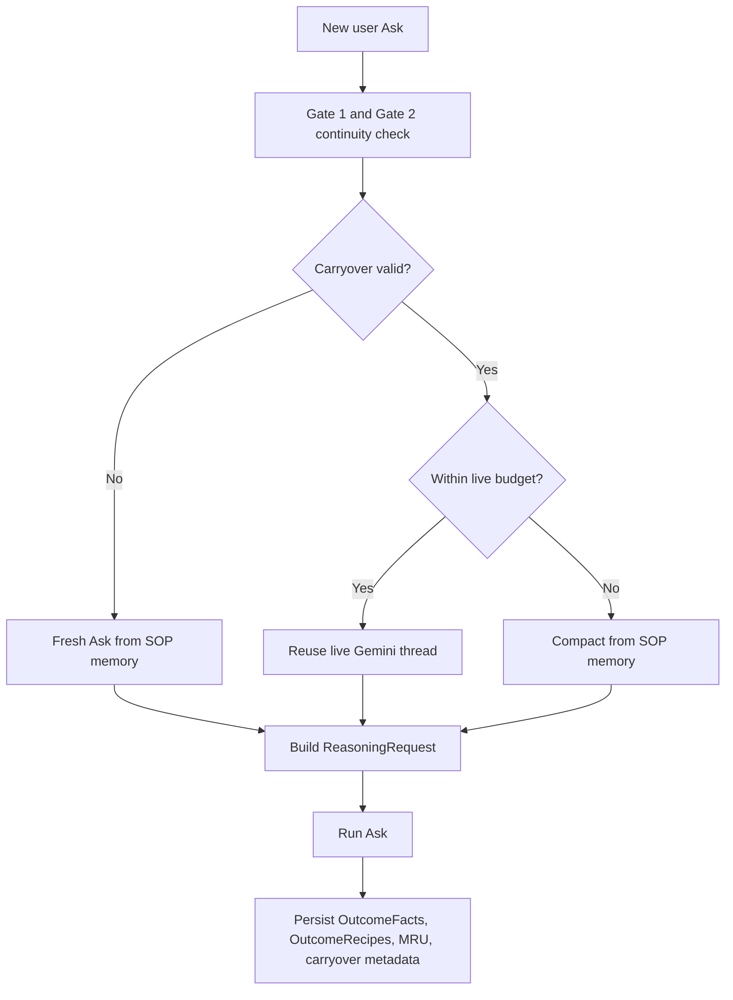
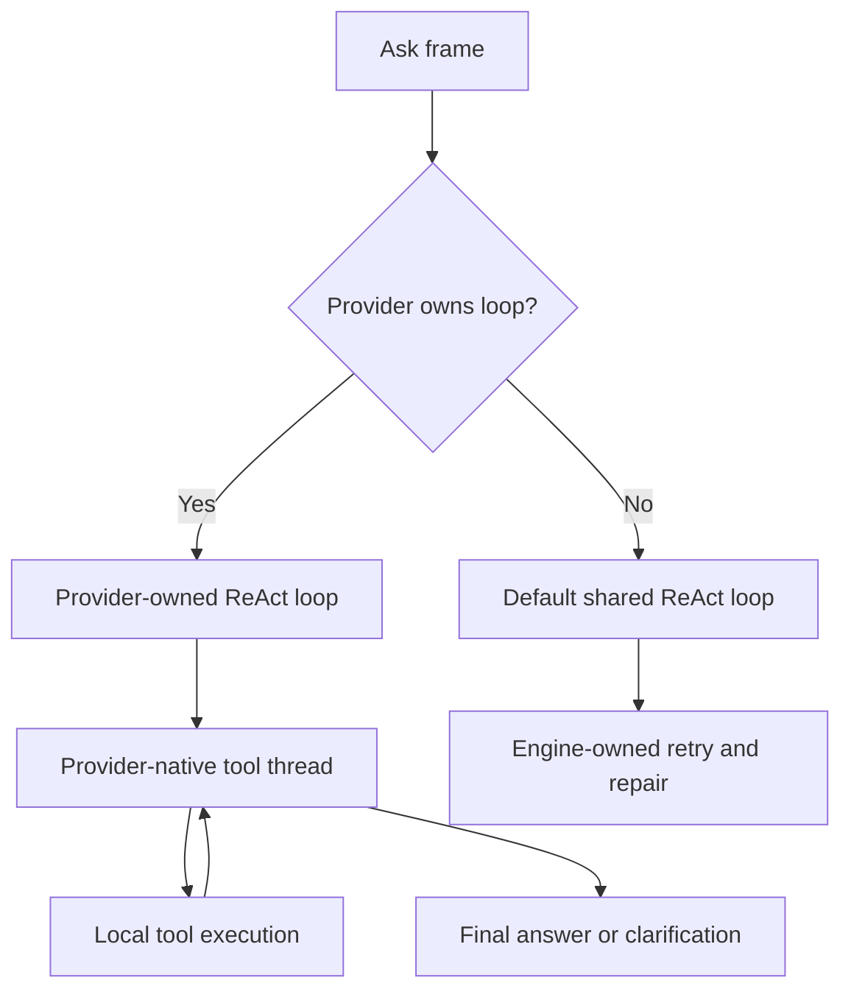
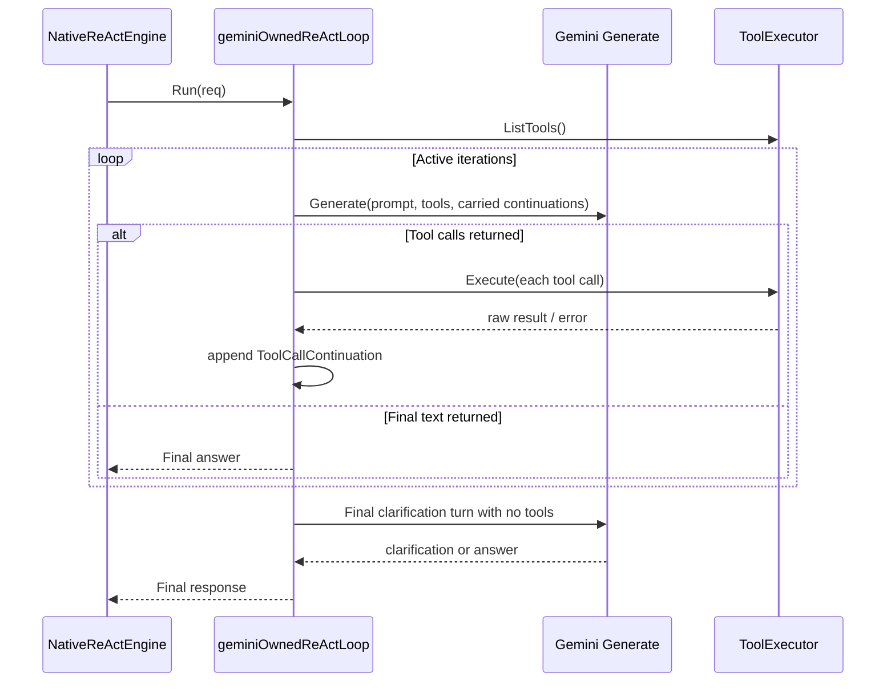

# Implementation

This document tracks architecture intent, implemented behavior, and explicit TODO items.

Conventions for this document:

- Present tense means the behavior is implemented.
- Pending work should be marked explicitly as `TODO:` or kept in a `TODO` section.
- Avoid describing unfinished work as if it already exists.

## Architecture Philosophy

- Avoid hardcoding prompt-engineering limits in the Go binary.
- Keep architectural constraints in playbooks and knowledge bases so behavior can evolve without backend redeploys.
- Drive alignment through deterministic context injection and explicit routing, not ad-hoc semantic guessing.

## Status Snapshot

### Implemented

- Gate 0 now exists as an explicit pre-routing Ask mode layer for retry-the-same-ask and clarification-resume behavior.
- Gate 0 state is typed in session payload via explicit retry and clarification state rather than relying only on ad-hoc variable keys and thread heuristics.
- Clarification-first Ask flow is implemented: when the assistant emits a real clarification question with no tool calls, the session persists a pending clarification state and the next user reply resumes the original target ask deterministically.
- Retry-the-same-ask rewrites are now tracked as explicit typed retry state and feed the next Ask as a resumed target query.
- Three-gate intent routing is active.
- Focused context assembly runs after classification.
- Stores prompt context is artifact-scoped and relation-aware.
- CRUD-scoped operation guidance is injected for focused execution.
- Batch-first CRUD and search patterns are established in the AI layer.
- SearchByPath lexical fast-path is active.
- Native Ask/ReAct micro-loop now keeps Ask-local state through Ask-anchored MRU compaction between inner-loop iterations.
- Native Ask loop now uses a progress-aware retry budget: base 5 iterations, bounded extension up to hard cap 15 when grounded progress is detected.
- Structured native tool envelopes are active via `tool_result` plus `progress_hint`, and the engine now interprets hints for progress, repair guidance, and terminal hard-stop behavior.
- Recoverable native-loop repair flows are implemented for malformed native tool calls, same-tool argument repair, and research-first `list_stores -> execute_script` retries.
- Terminal native hard-stop handling is implemented for explicit tool hint statuses such as `hard_error`, `blocked`, `anti_success`, and `terminal_error`.
- Initial user-visible terminal envelope adoption is implemented for `list_stores` progress hints and concrete `fetch` / `update` / `delete` not-found outcomes under native Ask execution.
- A real end-to-end native Ask regression now covers the "Find John" Stores query path through repair, grounded `list_stores` research, corrected `execute_script`, and final answer synthesis.
- Gate 2 now builds a generic continuity digest from MRU signals plus routing state instead of relying only on raw typed routing context.
- Gate 1 explicit anchors now flow into Gate 2 continuity evaluation as fresh evidence for refinement and stale-context reset decisions.
- Focused tests now cover continuity-digest carry-forward, anchor-aware continuity prompts, and Gate 2 routing prompt assembly.
- Stores system-tools prompt assembly now uses a compact protocol slice that keeps research guidance and minimal `execute_script` reminders while dropping the large example block from the runtime Ask frame.
- Explicit Stores workflow recipes are now split into smaller Gate 3 slices for schema-first research, grounded read transaction flow, join-slice repair, and predicate grounding, and the recipe budget now preserves those slices without truncation.
- Native tool exposure now treats `execute_script` and `list_stores` as first-class Stores tools under routing, so Gate 3 recipe selection and the visible tool set stay aligned.
- CRUD-driven native tool exposure is now centralized behind an explicit gating helper and covered by focused Stores and Spaces routing tests.
- The native retry controller now treats newly learned implicit recipes as live progress signals, so a successful repair pattern can extend the current Ask budget even when no fresh tool hint arrives on that step.
- Native retry prompts now expose concrete tool args together with repair detail and the most recent successful hint context, so the model can refine the next Ask/tool call from what improved, what remains missing, and which script slices should be preserved.
- `execute_script` join guidance is now explicit in both tool schema and stable instruction text: after `list_stores` confirms a relation path, prefer `relation + target` for join repair, and only rewrite the invalid join slice when a concrete `on` mapping is still needed.
- Join-related recoverable repair and clarification payloads now preserve validation category, suggested fix example, attempted args, and a join-specific repair note, so routed ambiguity escalation stays grounded in the actual failed mapping instead of collapsing into a generic clarification request.
- Provider-owned loops now share one provisional in-loop memory sink contract via `MemoryHydrationSink` in `ai/interfaces.go`; provider loops should emit only bounded grounded updates through that shared contract rather than inventing provider-specific in-loop memory paths.
- MRU now operates as a deliberate two-layer model: ask-progress MRU is ask-scoped and provisional inside a running Ask, while session MRU plus STM snapshot is the canonical between-Ask continuity source. Epilogue clears provisional ask-progress MRU and promotes only the final ask outcome into the session/STM carryover path.

### Open TODO

- [ ] Document-to-Space tool for promoting resolved insights into curated Spaces.
- [ ] Clarification fallback tool for unresolved ambiguity after autonomous research.
- [ ] Additional Omni consumption hardening for cross-database loopback flows.
- [ ] Medical Space showcase package for deep-domain demonstration.

### Document To Space (Declarative vs Episodic Bridge)

Concept carried from the previous design plan:

- Curated UI spaces are declarative knowledge assets.
- Conversational memory is episodic and auto-enriched.
- The platform needs an explicit bridge tool so high-value resolved knowledge can be promoted from episodic flow into curated space content.

Open TODO details:

- [ ] Add a document_to_space tool contract.
- [ ] Define when assistant should propose promotion.
- [ ] Define moderation and review gate for promoted content.

## 1. Context Assembly Protocol

To avoid brittle RAG retrieval for critical tool definitions, context assembly follows deterministic routing and then deterministic expansion.

### Problem Statement

If critical tool manuals are fragmented and left to probabilistic retrieval, a degraded reasoning loop can miss required constraints and emit malformed scripts.

### Three-Gate Routing Architecture

Gate 1: Focused prefix routing.

- Input shape: explicit namespace such as omni:stores:users.
- Action: parse hard constraints and classify only the missing parts (mainly layers and CRUD intent).
- Result: deterministic route with low token overhead.

Gate 2: MRU continuity or switch routing.

- Input shape: query without explicit prefix, with inherited routing state.
- Action: verify continuation vs topic switch and update CRUD/layer scope.
- Result: preserve momentum while preventing topic drift.

Gate 3: cold-start discovery routing.

- Input shape: no prefix and no valid inherited context.
- Action: classify from a lightweight context outline (entities/domains/artifacts).
- Result: discover entity, domain, db artifacts, and layers from scratch.

### Focused Context Assembly (Post-Classification)

Classification output is intentionally compact. It must be expanded before prompt construction.

Design gap that was identified and fixed:

- The previous pipeline classified correctly but injected broad domain context.
- The missing step was deterministic expansion between classification and final prompt assembly.
- The gap was not in the classifier contract; it was in orchestration between routing and prompt construction.

Resolved design:

- Keep the three gates as classifiers only.
- Expand classification via a deterministic context assembler.
- Inject the expanded payload as a dedicated prompt component for focused execution context.

Insertion-point guidance:

- Conceptually correct location: immediately after routing succeeds and before final prompt build.
- Low-churn implementation path: expansion can be invoked during prompt construction as long as classification remains pure and expansion remains deterministic.

- Input contract: Domain, DBArtifacts, Layers with CRUD tags.
- Domain scope: inject only Stores or Spaces operating context.
- Artifact scope: inject only the classified targets.
- CRUD scope: inject only relevant API and operation guidance.
- Relation scope: inject store relation metadata needed for joins/traversal.

Artifact expansion checklist:

- store name
- description when present
- inferred field/schema
- key schema when present
- relations
- optional tiny sample shape only when useful

Example envelope for Stores + users + R:

- users schema details
- users relations
- read transaction and AST guidance such as open_db, begin_tx read, open_store, scan, filter, project, join, limit

CRUD-to-API expansion mapping:

- C maps to create/save/upsert flows.
- R maps to read flows such as open_store, scan, get/find/select/filter patterns.
- U maps to mutation flows such as update/patch/save.
- D maps to delete/remove flows.

Suggested internal model:

- IntentExecutionContext assembled from TaskContextClassification.
- Prompt assembly consumes only IntentExecutionContext, not raw coarse classification.

### Hybrid Tool Injection Strategy

- Tool context must be constrained by CRUD tags.
- If D is not tagged, delete-oriented guidance should not be injected.
- If only R is tagged, read-first execution guidance should dominate the context.

## 2. Domain Guardrails and Clarification

### Objective

Prevent unknown-unknown hallucinations when schema links or constraints are missing.

### Guardrail Model

- Use semantic overrides in KB instructions rather than binary hardcoding.
- Require schema-mapping validation before generating AST scripts.
- Enforce halt-and-clarify behavior when ambiguity remains after research.

### Clarification Workflow

1. Autonomous research first using read/search tools.
2. If unresolved, explicitly ask the user for missing constraints.
3. Persist the clarification as explicit session state tied to the current target ask.
4. Rewrite the user's next reply back onto the target ask and resume the normal Ask lifecycle.

### Current Gate 0 Model

- Gate 0 runs before Gate 1, Gate 2, and Gate 3.
- Gate 0 is not a separate execution engine; it is a turn-mode controller.
- Gate 0 currently owns:
- retry-the-same-ask detection and rewrite
- clarification-resume detection and rewrite
- stable target-ask preservation across clarification turns
- Gate 0 does not execute tools itself.
- After Gate 0 rewrites the effective query, the normal Ask pipeline continues through routing, prompt assembly, native ReAct, tool execution, and epilogue.

### Current Clarification Completion Rule

- A clarification round remains pending only when the assistant returns a real clarification question and emits no tool calls.
- When the resumed Ask later emits tool calls, the native reasoning engine executes them normally.
- When the resumed Ask later returns a normal non-question answer, the clarification state is cleared.
- Readiness for tool execution is therefore detected structurally by native tool-call presence in the downstream reasoning engine, not by a separate Gate 0 semantic classifier.

### Open TODO

- [ ] Formalize a dedicated ask_user or clarify_intent tool contract in this implementation track.

## 2.5 Prompt Progression Refactor Track

### Why This Track Exists

- The current two-layer routing simplification is acceptable, but later defensive prompt additions diluted the original fidelity goal of the routing pipeline.
- Stores prompt assembly now carries too much repeated guidance, which reduces the chance that the LLM will do tool-based research during a live Ask.
- The system already has stronger runtime validation and more informative retry responses, so prompt assembly can be reduced and made more progressive.

### Signal and Protocol Goal

- Context blocks, tool manuals, focused execution hints, and recipes should all be treated as signals expressed through a shared protocol rather than as special hardcoded prompt categories that only Omni understands.
- The ReAct loop, Agent, and LLM should not depend on knowing whether a signal originated from compiled Go tools, Stores and Spaces integration code, playbooks, or a custom KB.
- Compiled Go surfaces such as Stores and Spaces remain important implementation providers, but they should enter the prompt and loop as protocol-compliant signals, recipes, and state transitions.
- This keeps the runtime design generic enough that Avatar can behave like Omni at the Ask level even when Avatar is grounded primarily in its own LTM or KB rather than the low-level compiled Stores and Spaces surfaces.
- In that model, Avatar Ask should be able to interrogate and digest Avatar-owned knowledge sources using the same macro and micro loop contracts, producing comparable user experience quality in another domain.
- The design goal is therefore not "Omni-specific prompt engineering," but a reusable signal protocol that allows different agents and knowledge providers to plug into the same routing, assembly, and ReAct progression model.

### Relation to Memory Layers

- This track is intentionally scoped to MRU first.
- The progressive Ask multi-loop and progressive multi-Ask exchange can be designed as a self-contained MRU flow.
- The inner multi-loop should use an Ask-anchored MRU, while the outer multi-Ask flow uses session MRU.
- Existing STM persistence through `logEpisode` is sufficient for now and does not need to be expanded in this track.
- LTM integration is deferred to a later phase once the MRU-first loop is stable.

### Gate Alignment Plan

- Gate 1 remains the deterministic anchor. Keep prefix-based focused routing because it is generic and aligns with the future macro/micro loop split.
- Gate 2 remains the continuity or topic-switch decision point, but its input should become a generic continuity digest built from MRU plus the last routing state instead of relying primarily on raw domain-shaped routing JSON.
- Gate 1 and Gate 2 should enrich each other rather than behaving like isolated filters. Gate 1 provides an explicit anchor signal from the current query; Gate 2 decides whether that anchor continues, narrows, extends, or replaces prior continuity.
- Gate 3 remains the cold-start discovery and prompt-assembly handoff, but it should consume the merged gate result and retrieve smaller recipe slices instead of replaying broad manuals.
- Gate 3 is still active, but it is now narrower than before because conversation-mode control has shifted into Gate 0.
- Gate 3 remains a cold-start routing/classification surface, not a clarification surface.
- Low-confidence or underspecified cold starts are better handled by deferring into clarification mode than by forcing Gate 3 to infer user-preference choices internally.
- Each gate should operate on protocol-level signals and recipes so the same control flow can serve Omni, Avatar, and future domain-specific agents without binding the loop to Stores and Spaces internals.
- The gates belong at Ask activation time as macro-loop setup. They should shape the initial Ask frame and follow-up Ask continuity, but they should not run inside the inner native ReAct micro-loop.
- The micro multi-loop should remain owned by the reasoning engine and Ask-anchored MRU. Gate outputs are inputs to the Ask frame, not per-iteration control logic.

### Gate 2 Continuity Digest

- Gate 2 should package current MRU entries into a compact continuity digest that the LLM can reason over in general terms.
- The digest should be domain-agnostic in structure even when the underlying facts are domain-specific.
- The digest should optionally carry the current Gate 1 anchor so continuity can be decided against explicit fresh evidence instead of only stale session state.
- Preferred digest fields are:
	- `summary`
	- `current_goal`
	- `confirmed_facts`
	- `open_questions`
	- `recent_patterns`
	- `suggested_next_moves`
	- `active_domains`
	- `active_artifacts`
- The previous typed `TaskContextClassification` should remain available as a secondary hint, not the primary continuity surface.
- Gate 2 should continue deciding only continuity versus switch and light scope refinement. Detailed tool choreography remains outside Gate 2.
- When Gate 1 is present, Gate 2 should be allowed to confirm that the prefix is a continuation, refine it with carry-forward continuity, or classify it as a topic switch that resets stale MRU while preserving the new anchor.

### Gate 3 Recipe Slicing

- Gate 3 should move from broad manual injection toward smaller reusable recipe slices.
- Manuals should become authoring sources for recipe extraction, not the default runtime prompt payload.
- Gate 3 should receive the merged handoff from Gate 1 plus Gate 2 rather than treating each gate as a separate world.
- Recipe containers should remain generic in structure so they can serve future domains even when individual recipes stay domain-specific.
- Each recipe slice should stay compact and carry only the trigger, protocol, invariants, preferred tools, and evidence needed for the current Ask.

### Execution Order

1. Add a generic Gate 2 continuity digest builder over MRU plus routing state.
2. Allow Gate 1 focused anchors to flow into Gate 2 so continuity is judged against fresh explicit query signals.
3. Update the Gate 2 prompt contract to consume the digest first and typed routing second.
4. Add focused tests for digest rendering, Gate 1 and Gate 2 handoff, and continuity classification behavior.
5. Slice generated Stores recipe content into smaller recipe-oriented units and prefer those units during prompt assembly.
6. Add prompt assembly regressions for single-Ask progression and follow-up Ask reuse.
7. Add a Gate 3 low-confidence / ambiguity outcome that can explicitly defer to clarification mode instead of forcing a cold-start classification guess.

### Ask-Anchored MRU

- Each user Ask creates its own internal exchange space inside the Ask/ReAct engine.
- Even though the engine treats this as an inner loop, each iteration is still just another LLM call from the model's perspective.
- Because of that, the inner loop can and should use an Ask-anchored MRU to make successive LLM calls progressive instead of repetitive.
- The Ask-anchored MRU is not the same as session MRU.
- Ask-anchored MRU is local to one Ask and exists only to compact the current grounded state between internal LLM turns.
- Session MRU remains the continuity layer across separate user asks.

### End-to-End Loop-Back Flow

The design ties together in one looped progression path rather than two disconnected behaviors:

1. User Ask enters routing.

- Routing decides domain and CRUD emphasis.
- MRU contributes recent continuity hints.
- STM is not part of the active design surface for this phase beyond existing `logEpisode` persistence.
- LTM is out of scope for this phase.

2. Prompt assembly creates an Ask frame.

- The Ask frame is a compact, task-specific view built from routing + MRU.
- It should contain the active tools, current uncertainty, prior confirmed facts, and any follow-up continuity from the immediately previous Ask.
- For the first internal LLM call of the Ask, this frame comes from routed context plus session MRU.
- Gate 1, Gate 2, and Gate 3 complete before the inner ReAct loop begins. Their result is the Ask frame handed to the reasoning engine.

3. ReAct loop executes inside that Ask frame.

- Each tool call and tool result updates Ask-local working state.
- Ask-local working state is the volatile per-Ask state that feeds MRU compaction when the Ask completes.
- Retry, repair, and research decisions should be based on this Ask-local state rather than re-reading large static manuals.
- For iteration 2 and beyond, the model should be driven by Ask-anchored MRU compaction rather than broad prompt replay.
- The routing gates should not be re-entered for each inner-loop iteration. Inner-loop progression should stay inside the reasoning engine unless a future design explicitly introduces a higher-order macro Ask transition.

4. Iteration loop-back happens inside the same Ask.

- Tool result or failure is classified.
- The system updates the Ask-local state with newly confirmed facts, partial correctness, and failure category.
- The next iteration consumes that updated Ask-local state and produces a narrower next action.
- This is the progressive multi-loop behavior within one Ask.
- This is the point where the inner loop becomes progressive: the next LLM call sees the compacted current truth, not the same broad context again.

5. Ask completion writes back to session memory.

- When the Ask finishes, the final outcome is compacted into an Ask Outcome artifact.
- The Ask Outcome updates MRU with the most recent successful or failed pattern.
- Existing STM logging through `logEpisode` remains as-is for now.

6. Next Ask re-enters through a memory-informed frame.

- The next Ask reads MRU for continuity and recent successful patterns.
- It does not replay the entire previous prompt; it reuses the compacted MRU result of the previous Ask.
- This is the progressive multi-Ask behavior across a session.

7. Durable knowledge promotion is selective.

- STM/LTM promotion rules are deferred to part 2.
- For now, temporary research artifacts, one-off failures, and execution details only need to be compacted well enough for MRU reuse.

### Macro Refactor Plan

Objective: restore routing fidelity and reduce prompt tax while preserving tool-based recovery.

1. Keep the simpler routing shape.

- Preserve the current easier routing model rather than restoring a more fragile classifier contract.
- Use routing to narrow the task, not to fully solve ambiguity.

2. Make routing output drive active tool exposure.

- CRUD and domain must decide which Stores and Spaces tools are exposed to the native tool-calling model.
- For Stores read-oriented flows, the primary tools should be `list_stores` and `execute_script`.
- Mutation-oriented flows can expose the minimal additional mutation tools needed.

3. Reduce always-injected prompt bulk.

- Generated Stores and Spaces tool-description slices should remain compact invariant context, not large reference documents.
- Remove duplicated guidance already covered by runtime validation, retry hints, or tool schemas.
- Avoid injecting multiple overlapping `execute_script` guidance slices from different paths.

4. Prefer tool-based precision over prompt-based overexplanation.

- If ambiguity remains around schema, field types, or relations, the LLM should be encouraged to research with `list_stores`.
- Runtime validation and retry directives should carry the detailed defect information, rather than always-on manuals.

5. Make follow-up asks progressive.

- Multi-ask sessions should reuse resolved facts and prior successful patterns, not rebuild a static full prompt each turn.
- Carry forward compact working state, not repeated tutorials.
- This should come from MRU compaction first; STM/LTM enrichment can be layered later.

## 2.6 Recipe Layer (Explicit + Implicit)

### Why Recipes Must Be First-Class

- Facts and recipes are not the same thing.
- Facts tell the model what is true: schema, relations, active database, confirmed join mappings, confirmed filter shapes.
- Recipes tell the model how to proceed: which tools to call, in what order, under what invariants, and what must be preserved during repair.
- Structured tool descriptions and curated recipe slices are seed material for explicit recipes, and the runtime payload should stay light and topic-scoped.

### Recipe Types

1. Explicit recipes

- Curated, human-authored protocols such as Stores read orchestration, Spaces discovery/mutation, or script authoring.
- Generated Stores/Spaces tool-description context and explicit recipe slices are the runtime recipe sources, and they should be injected as compact recipe summaries rather than broad manuals.
- Custom Spaces must be able to define their own explicit recipes later.

2. Implicit recipes

- Learned from successful interaction patterns.
- Micro recipe: learned from one Ask's successful inner loop or repair sequence.
- Macro recipe: learned from repeated successful sequences across multiple Asks.

### Recipe Model

Add a first-class `RecipeItem` beside `MRUItem`.

Suggested fields:

- `ID`
- `Kind` = explicit | implicit
- `Scope` = micro | macro | space | global
- `Domain`
- `Topic`
- `Trigger`
- `Protocol`
- `Invariants`
- `AntiPattern`
- `Tags`
- `Confidence`
- `Source`

### Retrieval Model

Prompt assembly should retrieve recipes separately from facts.

Priority order:

1. Space-scoped explicit recipes
2. Cross-domain recipes
3. Domain recipes
4. Global recipes
5. Learned implicit recipes ranked by specificity and confidence

The prompt stack should evolve toward:

- persona
- facts
- selected recipes
- focused execution context
- user query

### Extraction Rules for Implicit Recipes

- Learn only from successful, grounded tool sequences.
- Do not learn from raw answer text alone.
- Keep generalized protocol and invariants.
- Strip one-off values and request-specific literals.

Examples:

- Keep: `list_stores -> execute_script`, `begin_tx(mode=read)`, `replace only malformed join slice`.
- Drop: `John`, `orders > 1000`, specific output rows.

### Implementation Phasing

Phase 1: explicit recipe layer.

- Add `RecipeItem` and a `workflow_recipes` prompt component.
- Select compact explicit recipes from routing/classification.
- Keep this separate from MRU fact continuity.

Phase 2: implicit micro recipes.

- Extract from successful inner Ask loops and validated repair paths.
- Attach evidence and confidence.
- Foundation landed: successful `engine_native` repair/research sequences now emit learned micro recipes, session STM snapshots them separately from MRU facts, and `workflow_recipes` rehydrates them on later asks.
- STM recipe snapshots now merge by recipe ID across asks, preserve older distinct micro recipes, and cap the carried set so `workflow_recipes` stays bounded.

Phase 3: implicit macro recipes.

- Promote only after repeated successful multi-Ask patterns.
- Support custom Space recipe namespaces and override rules.

### Micro Loop Plan (Single Ask / ReAct Iterations)

Objective: improve convergence probability inside one Ask by making each loop iteration accumulate knowledge.

Design note: even though this is implemented as an internal loop in the Ask/ReAct engine, the model still experiences it as repeated LLM calls. Therefore the loop must progress through Ask-anchored MRU compaction between calls.

1. Track Ask-local working state.

- Maintain compact per-Ask state for:
	active domain
	resolved stores
	researched schema facts
	researched `relations=[...]`
	last successful tool pattern
	last failure category
- This Ask-local state is the short-lived execution state that will be compacted into MRU on Ask completion.
- This Ask-local state is also the source material for Ask-anchored MRU updates between inner-loop iterations.

2. Differentiate retry classes.

- Provider malformed call: simplify and retry one valid tool call.
- Ambiguity failure: research first.
- AST shape failure: retry the same tool with a narrow repair instruction.
- Runtime failure with confirmed facts: preserve valid arguments and repair only the broken slice.

3. Add research escalation.

- When a failure indicates schema, field-type, or join-mapping uncertainty, the next loop step should prefer `list_stores` instead of immediately retrying `execute_script`.
- This should be explicit in retry directives.

4. Preserve partial correctness.

- Carry forward valid store names, valid relation mappings, valid transaction shape, and valid pipeline variables between iterations.
- Only the invalid part should be rewritten by the next loop attempt.
- This is the core anti-repetition rule for the inner loop: preserve what is already correct, isolate what is still wrong, and let the next LLM call focus only on the delta.

5. Reduce prompt size after iteration 1.

- Once an Ask has begun, the loop should rely on current Ask working state plus targeted repair/research directives.
- Native loop now uses a progress-aware budget: base 5 iterations, extend one step at a time up to hard cap 15 only when new grounded facts, learned recipes, or structured tool progress hints show the Ask is converging.
- Tools can now indirectly guide the next loop pass via a structured JSON envelope: `{"tool_result": <payload>, "progress_hint": {"status": "progressing|complete|closer", "completion_delta": 0.0-1.0, "tips": [], "clues": [], "missing": [], "suggested_next_tools": []}}`.
- The engine owns interpretation of these hints and projects them into Ask-anchored MRU; tools do not mutate scratchpad or MRU directly.
- It should not keep depending on repeated heavy manual content.
- In practice, iteration 2+ should read like an Ask-anchored MRU refresh, not like a new Ask built from scratch.

6. Ask-loop state model.

- The loop's source of truth is the ordered `toolResults` history for the current Ask. There is no separate hidden workflow state machine.
- Before each new LLM call, the engine rebuilds an Ask-anchored MRU summary from that history and injects it into the next prompt.
- The Ask-anchored MRU carries: iteration count, last tool, last outcome, current focus, preserved valid work, grounded confirmed facts, next repair delta, and any tool-provided hints (`progress`, `tips`, `clues`, `missing`, `suggested_next_tools`).

7. Ask-loop transition table.

| Signal | Engine interpretation | Next loop behavior |
| --- | --- | --- |
| tool completed with new grounded facts | progress | preserve valid work, compact facts into Ask MRU, allow another step, and extend budget if this is a new delta |
| tool completed with new learned repair/research recipe | progress | preserve the successful pattern, keep narrowing, and extend budget if this is a new delta |
| tool completed with `progress_hint.status in {progressing, complete, closer}` | progress | carry hint fields into Ask MRU and allow one more bounded step |
| tool completed with `completion_delta > 0` or non-empty `tips/clues/suggested_next_tools` | progress | treat as convergence evidence even if no new facts were extracted yet |
| tool completed but produced no new facts, no new recipe, and no positive hint | stall | do not extend budget; continue only within the current allowed cap |
| tool result contains `Retry instruction:` | regress / repair-required | mark `Last outcome = repair_required`, preserve valid args, restrict next action to the repair path |
| model attempts the wrong tool while a repair is pending | regress | block the diversion, append a repair reminder, and force the next iteration back onto the allowed repair tool |
| tool execution error classified as recoverable | fail-soft / repair-required | convert the error into structured retry guidance instead of terminating the Ask |
| malformed native tool call from the model | fail-soft / repair-required | retry at repair temperature with a directive to emit exactly one valid tool call |
| tool execution returns non-recoverable Go error | fail-hard | stop the Ask immediately and surface the error |
| tool returns `progress_hint.status in {anti_success, blocked, error, failed, fatal, hard_error, terminal_error}` | fail-hard | short-circuit the Ask immediately and return the tool result as the final response |
| model stops calling tools | success | synthesize or return the final answer from the accumulated Ask state |
| loop reaches allowed iteration cap without terminal success/failure | exhausted | perform one final synthesis pass with `Do not call any more tools.` |

8. Practical meanings.

- `progress` means the Ask became more grounded: new confirmed facts, a newly proven recovery pattern, or a positive tool hint that narrows the next step.
- `success` means the model no longer needs another tool call and can answer from the accumulated grounded state.
- `regress` is not a first-class enum in code; it is inferred from repair-required states, blocked tool switching during repair, or repeated steps that create no new delta.
- `fail-soft` means the loop should continue, but only through a constrained repair or research path.
- `fail-hard` means stop immediately: either a non-recoverable execution error or a terminal negative tool hint explicitly says the Ask should not continue.

9. Terminal-status policy.

- User-visible terminal outcomes should normally return a structured tool envelope with `progress_hint.status = terminal_error` and a plain-language `tool_result` that can be surfaced directly to the user.
- Good candidates for `terminal_error`: key not found, item not found, policy-blocked action, permission denied, unsupported operation in the current mode, or any terminal condition where retrying the same exact call is not productive.
- Infrastructure or orchestration failures should stay typed Go errors instead of tool envelopes. Examples: executor misconfiguration, provider transport failure, expired credentials, or internal invariant violations.
- The rule of thumb is: if the message is a meaningful user-facing outcome, keep it as `tool_result`; if the caller needs system-level retry or fallback behavior, return an actual error.

### Progressive Native ReAct Loop (Implemented Architecture)

This is the current architecture of the inner progressive Ask loop.

1. Macro loop prepares the Ask frame; micro loop executes inside it.

- Gate 1, Gate 2, and Gate 3 run before the native reasoning engine starts.
- Their output becomes the Ask frame: persona, focused tools, recipes, continuity context, and user query.
- The native ReAct engine then owns all per-iteration retry, repair, and progression behavior inside that fixed Ask frame.

2. The loop's source of truth is ordered tool history, not a hidden planner.

- Each inner iteration appends one `nativeToolResult` containing tool name, args, tool result text, and optional structured progress hint.
- Before the next LLM call, the engine rebuilds an Ask-anchored MRU summary from that ordered history.
- This keeps the loop progressive without introducing a second internal workflow graph that could diverge from what the model actually saw.

3. The LLM sees a compact retry frame, not a cold restart.

- Iteration 1 starts from the routed Ask frame.
- Iteration 2 and beyond receive:
	- original context and user query
	- Ask-anchored MRU summarizing current focus, preserved valid work, grounded facts, missing pieces, and suggested next tools
	- repair directive when the latest step is recoverable
	- ordered tool history with concrete `[Tool Args]` and `[System Tool Response]`
	- a structured `Progression history` array where each step exposes:
		- `ingredients`
		- `generated_call`
		- `result`
		- `progression`
- The combined retry prompt is now also under a hard total character budget.
- When that budget is exceeded, trimming happens in a fixed order: Ask-anchored MRU first, then older history, then progression history, then focused context, while the latest actionable tool results, repair directive, and user query are kept longest.
- The engine logs which section trimmed first and the per-section reductions, so prompt overflows are diagnosable without changing STM/LTM state.
- This is what lets the model refine the next call from actual improving script slices and returned agent context instead of re-solving the whole problem from scratch.

Progression-history contract:

- `ingredients` is the compact per-step preparation surface, such as:
	- tool identity
	- confirmed facts when the step succeeded
	- repair strategy when the step is a repair step
- `generated_call` is the actual tool argument object that the model emitted for that step.
- `result` is the user-visible tool outcome or recoverable repair payload.
- `progression` is the live convergence metadata for the step, such as:
	- `status`
	- `completion_delta`
	- `tips`
	- `clues`
	- `missing`
	- `suggested_next_tools`
	- `retry_instruction`

- This separation is intentional:
	- `ingredients` tells the model what it had available for that step.
	- `generated_call` shows what it actually tried.
	- `result` shows what happened.
	- `progression` tells the model how close that step moved the Ask and what should happen next.

4. Structured tool envelopes are the live control surface.

- Tools can return:
	- `tool_result`: the user-visible payload
	- `progress_hint`: internal loop guidance
- `progress_hint` can carry:
	- `status`
	- `completion_delta`
	- `tips`
	- `clues`
	- `missing`
	- `suggested_next_tools`
- The engine consumes these hints to decide whether the Ask is progressing, what should be preserved, what is still missing, and whether the loop should stop immediately.

5. Recoverable retries are framed as delta repair, not full regeneration.

- Malformed native tool call: retry with a directive to emit exactly one valid tool call.
- Same-tool repair: preserve valid arguments and rewrite only the broken slice.
- Research-first repair: require `list_stores` before retrying `execute_script` when schema or relation grounding is missing.
- For join repair after `list_stores`, prefer `relation + target` when the researched relation path is confirmed; keep `on` only for concrete grounded field mappings and rewrite only the malformed join slice.
- If the model attempts an unrelated tool while repair is pending, the engine blocks the diversion and reasserts the repair path.

6. Progress is evidence-driven and bounded.

- Base loop budget is 5.
- The engine can extend the budget one step at a time up to 15.
- Extension only happens when the current Ask becomes more grounded through at least one of:
	- new confirmed facts
	- a newly learned implicit recipe
	- a positive structured tool hint
- No new grounding means no budget extension.

7. Newly learned recipes are part of live retry control, not just later memory.

- Successful repair paths are distilled into implicit micro recipes.
- Those recipes are returned as Ask outcomes and also counted as progress inside the same Ask.
- This means the retry controller and recipe system are intentionally coupled: once a repair pattern is proven, it can justify one more bounded step even if no fresh hint arrived on that exact iteration.

8. The model can refine the next Ask or next tool call from improving and missing signals.

- Because the prompt now carries returned context, concrete tool args, repair detail, preserved valid structure, and missing clues together, the LLM can:
	- keep valid script slices intact
	- narrow the next tool call to the broken part
	- switch into research-first mode when grounding is missing
	- effectively mint a refined internal "next ask" from what improved versus what remains unresolved
- This is the operational meaning of a progressive ReAct loop in this implementation: each call sees a compact current truth, not just another copy of the original user prompt.

9. Hard-stop semantics remain explicit.

- Tool hints with terminal statuses such as `anti_success`, `blocked`, `hard_error`, or `terminal_error` short-circuit the loop immediately.
- User-visible terminal outcomes stay in `tool_result`; infrastructure failures stay typed Go errors.
- This preserves a clean distinction between productive bounded retry and conditions where the loop should stop instead of spiraling.

10. Current provider support is intentionally uneven and should be tracked explicitly.

- The shared layer now exposes both turn-level and loop-level provider seams: `ReActTurnStrategy`, `ReActPromptBypassStrategy`, `ReActLoop`, and `ReActLoopProvider`.
- The default engine still exists as the provider-neutral implementation and remains the fallback for providers that do not supply an owned loop.
- Gemini now supplies a real provider-owned loop in `ai/generator/gemini.go` and is no longer just a transport adapter.
- OpenAI ChatGPT and Anthropic still currently use the default shared path in this implementation.

What the Gemini-owned loop now does:

- delegates from `NativeReActEngine.Run(...)` through `ReActLoop()`
- accumulates the full ordered `ToolCallContinuation` history across turns
- executes every native tool call returned in a Gemini turn, not just the first
- forwards `tool_call`, `tool_result`, and `tool_error` events through the request streamer
- executes tools with native tool-hint context and event-streamer context preserved
- enforces a real no-tool final clarification turn by clearing tool schemas on the cap-exhausted turn
- returns MRU-facing `OutcomeFacts` and `OutcomeRecipes` through the shared summarizer in `ai/outcome_summary.go` instead of maintaining a Gemini-only copy

Shared Ask outcome seam:

- `ai/outcome_summary.go` is now the single place that distills successful tool results into compact `OutcomeFacts` and learned `OutcomeRecipes`.
- `ai/agent/engine_native.go` uses that shared helper for the default path.
- `ai/generator/gemini.go` uses the same helper for provider-owned Gemini runs.
- MRU continuity and recipe snapshot behavior should be changed there rather than re-implemented per provider.

12. Carryover continuity design is now documented and should be treated as a bounded L1 cache, not as the primary memory system.

- Gemini-native carryover is valuable for short-horizon continuation across adjacent asks in the same live session.
- It is also expensive because the provider keeps prior tool payloads and conversational state in the active thread budget.
- SOP memory remains the durable and provider-neutral system of record: MRU, STM, LTM, and focused RAG retrieval still own compaction, auditability, session restore, and provider portability.
- The design goal is therefore not "let Gemini remember everything." The goal is "reuse live provider continuity while it is cheap and valid, then cut over to compact SOP memory when the budget or trust boundary says stop."

### Carryover Continuity Design Spec

Current Ask boundary:

- Each top-level Ask currently creates a fresh `ReasoningRequest` with `SystemPrompt`, `ContextText`, `HistoryText`, and `UserQuery`.
- Gemini already preserves continuity inside one Ask through ordered `ToolCallContinuation` values and provider-owned loop state.
- The reset happens after `engine.Run(...)` completes: the app persists compact `OutcomeFacts`, `OutcomeRecipes`, and MRU state, then the next Ask is rebuilt from app-owned context.

Implementation boundary for the next carryover phase:

- Inside one Ask, keep the current Gemini-owned loop behavior unchanged.
- Between adjacent asks, add a continuity policy that decides whether to reuse live Gemini carryover, compact it first, or cut over to a fresh Ask rebuilt from SOP memory.
- This policy should run before the next `ReasoningRequest` is assembled.

Carryover modes:

- `off`: always start the next Ask from SOP memory and focused retrieval.
- `compact`: keep only provider continuity metadata plus compact SOP summaries such as `OutcomeFacts`, learned recipe IDs, routing state, and current topic identity.
- `live`: reuse the live Gemini conversation/tool thread directly when it is still valid and within budget.

Recommended default:

- Default to `compact` as the safe baseline.
- Allow `live` reuse only when continuity classification, cost budget, and trust boundaries all pass.

Continuity decision inputs:

- Gate 2 continuity result: continuation versus topic switch.
- provider name and model identity.
- active KB/domain fingerprint.
- ask chain length on the current live thread.
- idle age since the last use of the live thread.
- estimated carried token cost.
- estimated raw tool payload burden.
- safety or policy reset conditions.

Decision rules:

- Reuse `live` only when the next Ask is a true continuation in the same continuity lane.
- Downgrade to `compact` when the topic is still continuous but the live thread is growing expensive.
- Fall back to `off` when the topic changed, the provider/model changed, the active KB changed, the session was restored, or the thread exceeded hard limits.

Recommended initial limits:

- `LiveCarryoverMaxAsks = 3`
- `LiveCarryoverIdleTTL = 15m`
- `LiveCarryoverSoftTokens = 8000`
- `LiveCarryoverHardTokens = 12000`
- `MaxRawToolCarryTokens = 2000` per tool response
- soft cap heuristic: prefer `compact` once carryover exceeds roughly `20%` of the available input budget
- hard cap heuristic: force reset once carryover exceeds roughly `35%` of the available input budget

Reset triggers:

- Gate 2 classifies a topic switch.
- provider or model changes.
- active KB/domain changes materially.
- safety/policy state requires a clean frame.
- carried tool payloads become too large or too stale.
- idle TTL expires.
- estimated carryover cost exceeds the hard limit.

What stays app-owned even when live carryover is active:

- system prompt, policy, persona, and tool contract
- current user query
- active KB/domain identity
- compact MRU and recipe deltas when needed
- reset decisions and cost controls

What should be reduced when live carryover is active:

- broad `HistoryText`
- repeated thread transcript replay
- repeated raw tool result restatement
- duplicated Ask Outcome context that Gemini already still retains natively

Provider carryover state to store in session memory:

- provider name
- model name
- provider-native conversation or cache handle
- topic fingerprint
- KB/domain fingerprint
- started-at and last-used timestamps
- ask chain length
- estimated carried token cost
- estimated raw tool token cost
- last outcome facts and learned recipe IDs
- last tool names
- current carryover mode and last reset reason

Repository mapping for the next implementation phase:

- `ai/interfaces.go`: add provider-neutral carryover state and policy types.
- `ai/agent/memory_shortterm.go`: persist carryover metadata alongside thread, MRU snapshot, and recipe snapshot.
- `ai/agent/service.go`: run the carryover decision before assembling the next `ReasoningRequest`; suppress broad `HistoryText` replay when a valid live Gemini thread exists.
- `ai/agent/copilot.go`: persist the final Ask outcome and carryover metadata together at Ask completion.
- `ai/generator/gemini.go`: consume provider-native conversation handles and live/compact carryover options when building Gemini requests.
- `ai/outcome_summary.go`: remain the single compaction seam for `OutcomeFacts` and `OutcomeRecipes` used by the fallback path when live carryover is not reused.

Implementation phases:

1. Instrumentation only.

- Add carryover metadata and decision logging without changing request behavior yet.
- Log `live`, `compact`, or `off` decisions together with token estimates and reset reasons.

2. Compact mode first.

- Keep the current SOP-owned rebuild behavior.
- Add policy-driven reduction of `HistoryText` and repeated context replay when continuity is confirmed.
- Use MRU, `OutcomeFacts`, and learned recipes as the compressed continuity surface.

3. True live Gemini reuse.

- Introduce provider-native conversation handles.
- Reuse them only for the same provider, model, topic, and KB within budget.
- Reset or compact automatically when thresholds are crossed.

4. Adaptive tuning.

- Tune thresholds using observed token spend, reuse rate, and answer quality.
- Keep `compact` as the safe degradation path instead of jumping straight from `live` to a full reset.

Required instrumentation:

- continuity decision per Ask: `live`, `compact`, or `off`
- reason for the decision
- estimated carryover tokens versus fresh-frame tokens
- ask chain length
- raw tool payload token estimate
- reset cause

This is the intended control loop:

Why this architecture is the correct one:

- Gemini retains meaningful volatile thread state across the native conversation/tool exchange.
- The model therefore sees and mutates state that the app layer cannot reconstruct perfectly after the fact.
- If the app pretends to own that thread from above, it must re-parse, enrich, and summarize a lossy shadow copy of the true state.
- The thin-wrapper design fixes that mismatch: provider owns the live thread, app owns guardrails and execution.

Provider-owned loop sketch:

Gemini-owned loop sequence:

11. Focused retrieval already narrows prompts, but not yet the tool contract itself.

- Current implementation narrows the Ask through routing, focused context, recipes, and grounded tool results.
- The next missing optimization is to narrow provider tool registration at the same boundary, so Stage 1 retrieval constrains Stage 2 tool descriptions/schemas before the Ask/ReAct loop begins.
- This should reduce prompt bulk, lower hallucinated schema usage, and give runtime validation a tighter contract.

### Session Progression Plan (Multi-Ask)

Objective: let each Ask final result shape the next Ask without replaying static prompt bulk.

1. Persist an Ask Outcome artifact.

- After each Ask, store a compact record containing:
	final result summary
	tools used
	researched facts confirmed
	successful execution pattern
	failure summary if the Ask did not complete cleanly
- The Ask Outcome should be the bridge from the finished Ask into MRU.
- Existing STM `logEpisode` behavior remains unchanged in this phase.

2. Maintain a rolling working summary.

- For ongoing Stores work, carry forward:
	active database
	active domain
	researched stores
	schema summary
	relation summary
	last successful pattern
	last result summary
- This rolling summary is the MRU-facing continuity view that subsequent asks should consume.

3. Assemble the next Ask by delta.

- The next Ask prompt should contain what changed and what remains uncertain, not a replay of full old manuals.
- Follow-up asks such as "same query but > 1000" should reuse the existing Stores state directly.

### Operational Tying of Multi-Loop and Multi-Ask

- Single-Ask progressive multi-loop is the inner loop: tool call, result classification, Ask-local state update, next step.
- Multi-Ask progression is the outer loop: Ask completion, Ask Outcome compaction, MRU update, next Ask assembly.
- The inner loop writes into Ask-local working state.
- The inner loop should also maintain an Ask-anchored MRU view that is fed back into the next LLM call.
- The outer loop compacts the final Ask state into session MRU.
- STM/LTM design is intentionally deferred; current STM `logEpisode` behavior is sufficient for now.
- The overall loop-back flow is therefore:
	Ask -> Ask frame -> iterative tool loop -> Ask Outcome -> MRU update -> next Ask frame

### Memory Mapping

- MRU: recent Ask Outcome, current domain continuity, last successful tool pattern, last user-visible result, compact follow-up context.
- STM: unchanged in this phase; current `logEpisode` behavior is sufficient for now.
- LTM: deferred to part 2.
- Prompt assembly in this phase should prefer MRU as the progression layer.

### Recently Completed

- [x] DONE: Document bounded Gemini carryover design, carryover modes (`off`, `compact`, `live`), budget limits, reset triggers, repository mapping, and instrumentation requirements.

### Open Implementation TODOs

- [ ] TODO: Remove remaining duplicate `execute_script` guidance injection paths outside the compact Stores slice.
- [ ] TODO: Continue slicing generated Stores recipe content into more granular units for Gate 3 retrieval and prompt assembly beyond the current research/read/join/predicate split.
- [ ] TODO: Slice runtime guidance into smaller recipe-oriented units for Gate 3 retrieval and prompt assembly.
- [ ] TODO: Add per-session Ask Outcome storage and rolling working summary.
- [ ] TODO: Add provider-neutral carryover state and policy types in `ai/interfaces.go` for mode selection, token estimates, reset reasons, and provider conversation handles.
- [ ] TODO: Persist carryover metadata in `ai/agent/memory_shortterm.go` so STM can track live-thread validity across adjacent asks.
- [ ] TODO: Add continuity decision and carryover instrumentation in `ai/agent/service.go` before `ReasoningRequest` assembly.
- [ ] TODO: Implement `compact` carryover mode first by suppressing broad `HistoryText` replay and relying on MRU, `OutcomeFacts`, and learned recipes.
- [ ] TODO: Persist final Ask outcome and carryover metadata together in `ai/agent/copilot.go` at Ask completion.
- [ ] TODO: Add true Gemini live-thread reuse in `ai/generator/gemini.go` behind the carryover policy once compact mode and instrumentation are stable.
- [ ] TODO: Add tests for carryover mode selection, reset triggers, and reduced prompt replay on same-lane follow-up asks.
- [ ] TODO: Add prompt assembly tests for single-Ask progression and follow-up Ask reuse.
- [ ] TODO: Continue converting user-visible hard-stop tool outcomes from plain text to structured native terminal envelopes; keep infrastructure failures as typed Go errors.
- [ ] TODO: Let Stage 1 focused retrieval dynamically narrow provider tool registration before Stage 2 Ask/ReAct execution, instead of relying primarily on prompt-side narrowing.
- [ ] TODO: Extend the provider-owned model to other providers that can genuinely preserve a native tool/thread state.
- [ ] TODO: Continue moving Gemini-specific progression semantics out of generic shared shaping and into the Gemini-owned loop where the native thread is actually interpreted.

## 3. Roadmap and Release Details

### V1 Release Scope

### Foundational Goal

Production-ready knowledge base and orchestration core with deterministic context assembly and scalable data access.

### Target Deliverables

1. Batched-first native CRUD API parity across SDK and UI flows.
2. Omni knowledge consumption via transactional loopback and retrieval orchestration.
3. Lexical fast-path via SearchByPath.
4. Medical knowledge base demonstration as a deep-domain benchmark.

### Current Completion Markers

- Batched-first CRUD behavior: implemented.
- SearchByPath fast prefix scanning: implemented.
- Three-gate routing and focused context assembly: implemented.
- Native Ask-loop progression, bounded retry extension, and structured tool-hint interpretation: implemented.
- Initial native terminal-envelope rollout for user-visible hard-stop tool outcomes: implemented.
- TODO: Medical demo packaging.

## 4. V1.5 and V2 Deferred Scope

- Stateful avatar systems with richer specialization.
- Dynamic multi-avatar switching during live interaction.
- Deeper long-term episodic memory and persona continuity.

## Maintenance Guidance

- Keep implemented items and TODOs explicit.
- Prefer present tense only for shipped behavior; mark pending work explicitly as `TODO:`.
- Prefer status-oriented updates over free-form narrative drift.
- Preserve architecture rationale when refining implementation details.