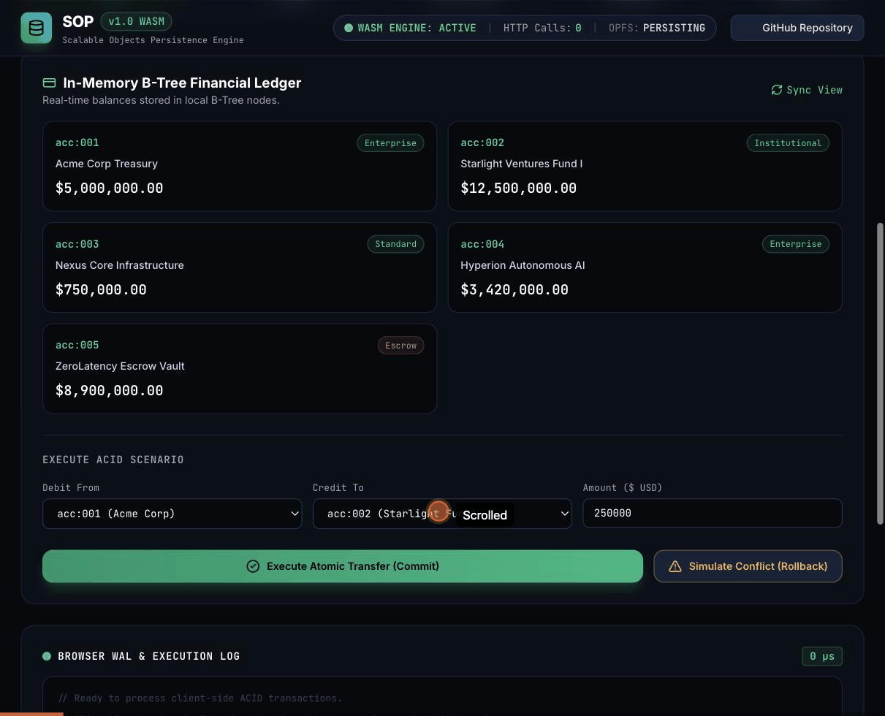

# SOP

<p align="center">
  
</p>

## One engine for data and compute.

**SOP** (Scalable Objects Persistence) is an embedded B-Tree storage engine and distributed computing platform written in Go with bindings for Python and C#. It combines **transactional data persistence**, **ordered key-value storage**, **vector similarity search**, and **swarm task coordination** into one library. 

Instead of managing separate database servers, message brokers, caching tiers, and distributed lock managers, SOP lets your application store data and coordinate distributed work in the same programming model.

[](https://github.com/SharedCode/sop/discussions)
[](https://github.com/SharedCode/sop/actions/workflows/go.yml)
[](https://github.com/SharedCode/sop/releases)
[](https://app.codecov.io/github/SharedCode/sop)
[](https://pkg.go.dev/github.com/sharedcode/sop)
[](go.mod)
[](LICENSE)
[](https://sharedcode.github.io/sop/arena/)

---

### 📉 Engineering ROI, Verified in This Repo

No revenue or customer numbers exist yet for this project (see [For Investors](#-for-investors) for the honest version of that). What is verified today, in this repo, is the infrastructure cost this architecture removes:

| What collapses | From | To |
| :--- | :--- | :--- |
| **Network hops per operation** | 3-4 hops across Redis, a queue, and Postgres/Cassandra (15-50ms) | 1 in-process call inside the embedded engine (sub-millisecond) |
| **Stateful services to operate, patch, and page on** | Redis + Kafka/RabbitMQ + Postgres/Cassandra + ZooKeeper (4+) | 1 embedded library |
| **Language surfaces shipped** | — | Go (native), Python (`sop4py` on PyPI), C# (`Sop` on NuGet); Java and Rust bindings exist in-repo with tests, not yet published |
| **CI rigor on every change** | — | Race detector + `govulncheck` across the matrix, `go test ./...` passing across 14 packages in the core Go module |
| **Deployment footprint of the technical demo** | A server-backed demo stack | WASM build running ACID transactions, vector search, and agent-memory checkpointing 100% client-side, 0 HTTP calls ([live](https://sharedcode.github.io/sop/)) |

Every row above is something you can run yourself, not a projection. See [Performance Benchmarks](#-performance-benchmarks) for the throughput numbers behind the latency claim, and [What Has Not Yet Been Proven](#-for-investors) for what this table deliberately leaves out.

---

## 🚀 Experience SOP

You can test SOP directly in your browser without installing anything:

| Experience | Description | Live Interactive Link |
| :--- | :--- | :--- |
| 🧠 **SOP Technical Demo** | **Client-Side Zero-Server WebAssembly Engine**<br>Execute live ACID transactions, 128-dimensional vector cosine searches, microsecond benchmarks, and durable AI agent memory checkpoints (kill the agent mid-task, watch a successor resume from the B-Tree) running 100% in your browser with **0 HTTP network calls**. | [**Launch Technical Demo →**](https://sharedcode.github.io/sop/) |
| 🎮 **SOP Arena** | **Distributed Systems Survival Simulation**<br>Command a live digital cluster. Scale worker swarms, crash storage nodes, trigger transaction storms, and watch SOP automatically redistribute tasks and rebuild parity in real-time. | [**Play SOP Arena →**](https://sharedcode.github.io/sop/arena/) |

<p align="center">
  
</p>

---

## 💡 What Problem Does SOP Solve?

Most distributed applications require two fundamentally different operations:
1. **Storing state reliably** (databases, key-value stores, vector indexes)
2. **Coordinating work across machines** (task queues, locks, retries, worker failovers)

Today, developers solve this by assembling a multi-component infrastructure stack:

```
THE FRAGMENTED MULTI-COMPONENT STACK (Without SOP):

[ Application ]
       │
       ├──► (TCP Hop 1: 5-15ms)  ──► Redis (Distributed Locks & Leases)
       ├──► (TCP Hop 2: 5-15ms)  ──► RabbitMQ / Kafka (Task Queue)
       ├──► (TCP Hop 3: 10-30ms) ──► PostgreSQL / Cassandra (Persistent Storage)
       └──► (Failover Glue)      ──► ZooKeeper / Custom Retry & Outbox Daemons

⚠️ 6+ infrastructure boundaries | 15-50ms latency tax | High split-brain failure risk | High maintenance overhead
```

When an application worker crashes between releasing a lock in Redis and committing to PostgreSQL, state can enter an inconsistent split-brain condition. Engineering teams end up spending substantial time writing and maintaining outbox listeners, lock renewers, and compensating retry logic.

---

## ⚡ Why SOP?

SOP takes a different approach: **co-locate storage and compute inside the same engine boundary.**

```
THE UNIFIED DATA & COMPUTE PLATFORM (With SOP):

[ Application ]
       │
       └──► (Embedded In-Process Call: < 0.3ms latency)
            ┌─────────────────────────────────────────────────────────────┐
            │                         SOP ENGINE                          │
            │  • Persistent B-Tree Storage (Sector-aligned Direct I/O)    │
            │  • Strict Serializable ACID Transactions (WAL + 2PC)       │
            │  • Swarm Compute & Autonomous Task Redistribution           │
            │  • High-Dimensional Vector Similarity Indexing (SIMD)       │
            │  • Reed-Solomon Erasure Coding & Partition Resilience       │
            └─────────────────────────────────────────────────────────────┘

✓ 1 Single Engine | Sub-millisecond execution | 100% ACID consistency | Automated failover
```

Because compute workers, task queues, and storage partitions share the same transaction boundary, a worker failure triggers an automatic rollback of uncommitted work and re-assigns the task in milliseconds with zero orphan locks.

---

## ⏱️ Why Now?

Three industry shifts make this architecture increasingly relevant:

1. **The Explosion of Autonomous AI Agents**: Multi-agent swarms require frequent context checkpointing, vector similarity searches, and task coordination. Assembling this across Postgres, Pinecone, Redis, and Celery creates high failure surface area.
2. **Edge and Local-First Computing**: Devices in factory automation, vehicles, and retail branches cannot rely on constant connections to central cloud databases. They need full ACID storage and local coordination that works offline.
3. **Infrastructure Simplification**: Engineering organizations are seeking to reduce the operational overhead and cloud bills associated with running dozens of discrete microservices just to manage state and queues.

---

## 🔍 What Makes SOP Different?

SOP is built on five core technical principles:

1. **Embedded Storage Engine**: Operates in-process in Go, Python, and C#, eliminating TCP network hops for local reads and writes.
2. **ACID Transactions without Database Servers**: Implements Write-Ahead Logging (WAL) and Two-Phase Commit (2PC) with copy-on-write page isolation.
3. **Swarm Compute Coordination**: Workers coordinate task execution using storage-anchored sector claims and heartbeat leases without requiring global consensus bottlenecks (like Paxos or Raft) on the hot path.
4. **Reed-Solomon Erasure Coding**: Protects storage shards from hardware failure by striping parity blocks across drives rather than paying the 3x disk storage cost of full replication.
5. **Integrated Vector & Structured Storage**: Stores high-dimensional vector embeddings in the same B-Tree segments as structured metadata, allowing single-transaction memory commits.

---

## ⚖️ SOP vs. Alternatives

Every architecture involves tradeoffs. Here is an honest comparison of where SOP fits relative to industry standards:

| Capability | PostgreSQL | Redis | Kafka | Temporal | Pinecone | SQLite | SOP |
| :--- | :---: | :---: | :---: | :---: | :---: | :---: | :---: |
| **ACID Transactions** | ✓ | △ | ✗ | ✗ | ✗ | ✓ | ✓ |
| **Ordered B-Tree Range Scans** | ✓ | △ | ✗ | ✗ | ✗ | ✓ | ✓ |
| **Embedded In-Process** | ✗ | ✗ | ✗ | ✗ | ✗ | ✓ | ✓ |
| **Swarm Work Coordination** | ✗ | △ | △ | ✓ | ✗ | ✗ | ✓ |
| **Vector Similarity Search** | △ (pgvector) | △ | ✗ | ✗ | ✓ | ✗ | ✓ |
| **Erasure Coding (N+K)** | ✗ | ✗ | ✗ | ✗ | ✗ | ✗ | ✓ |
| **Zero Standalone Daemons** | ✗ | ✗ | ✗ | ✗ | ✗ | ✓ | ✓ |

*Legend: `✓` First-class native capability | `△` Partial or requires plugin/extension | `✗` Not designed for this capability*

### Detailed Tradeoffs by Competitor:

- **PostgreSQL**: Industry standard for general relational databases. Choose Postgres when you need complex relational schemas, advanced SQL aggregations, or standard ecosystem tooling. SOP is better suited when you want an embedded storage engine inside your application process without database server management.
- **Redis**: Industry standard for ultra-low-latency in-memory key-value caching. Choose Redis when all data fits in RAM and you need simple cache operations. SOP provides durable B-Tree disk persistence, multi-account ACID transactions, and erasure coding.
- **Kafka / RabbitMQ**: Industry standards for high-volume streaming and pub/sub. Choose Kafka when you need multi-datacenter event streams and log retention. SOP provides transactional task queues co-located with storage state for local swarms.
- **Temporal**: Industry standard for long-running durable workflows spanning external microservices. Choose Temporal for multi-week human-in-the-loop workflows across disparate clouds. SOP is designed for local-to-cluster co-located data and task execution.
- **SQLite**: Industry standard for embedded single-file relational databases. Choose SQLite for client desktop/mobile apps needing SQL. SOP is designed for high-concurrency multi-threaded workers, clustered coordination, partitioned vector stores, and erasure coding.

---

## 🎯 When SOP is a Great Fit

- **AI Agent Memory & Swarm Workforces**: Autonomous agents requiring durable conversation memory, vector search, and task hand-offs without fragmented infrastructure.
- **Real-Time Systems & Simulation State**: Game servers, robotics, and spatial computing needing microsecond state serialization.
- **Financial & Escrow Ledgers**: Systems requiring strict serializability and invariant verification (e.g. zero-sum account delta) prior to commit.
- **Edge & IoT Computing**: Devices operating in intermittent network environments that need local ACID persistence and peer synchronization.
- **Serverless Workloads**: Cloud functions that need durable storage without exhausting database connection pools.

---

## 🚫 When SOP is NOT the Right Tool

To be completely clear on architectural boundaries:

- **Massive Analytical Warehousing**: If you are running multi-petabyte columnar analytics across billions of historical events, specialized OLAP warehouses (like ClickHouse or Snowflake) are the right choice.
- **Global Multi-Region Consensus**: If your application requires synchronous commits across continents with multi-region Raft/Paxos quorums, dedicated distributed SQL databases (like CockroachDB or Google Spanner) are designed for that problem.
- **Simple Stateless CRUD Apps**: If your application is a standard CRUD dashboard with low traffic, standard PostgreSQL or MySQL with an ORM is simpler and has more ecosystem plugins.

---

## 🎮 See SOP in Action (SOP Arena Simulation)

In **[SOP Arena](https://sharedcode.github.io/sop/arena/)**, every control maps directly to a real distributed systems concept:

| Simulation Control | Distributed Systems Concept | SOP Technical Mechanism |
| :--- | :--- | :--- |
| **Add Worker** | Swarm Compute | Dynamic queue rebalancing across peer worker nodes without central master bottlenecks. |
| **Remove Worker** | Graceful Degradation | Active tasks drained and re-assigned to healthy nodes with zero dropped writes. |
| **Kill Node / Storage Fault** | Fault Tolerance | **Reed-Solomon Erasure Coding** reconstructs missing B-Tree blocks in-memory from parity chunks. |
| **Transaction Storm** | Concurrency & Isolation | **Optimistic Concurrency Control (OCC)** serializes conflicting writes in microseconds. |
| **Increase Workload (100k TPS)** | Scalability | B-Tree node segments partition write load across sector-aligned storage handles. |
| **Automatic Self-Healing** | Resilient Coordination | Heartbeat lease detection triggers automated task redistribution in `<15ms`. |

---

## 👥 Who SOP Is For

SOP is one codebase, but different people will care about it for different reasons. Jump to the section that matches you:

[Investors](#-for-investors) · [Investment Banking & Tech Finance](#-for-investment-banking--technology-finance) · [Potential Customers](#-for-potential-customers) · [CTOs & Engineering Executives](#-for-ctos--engineering-executives) · [AI Infrastructure Teams](#-for-ai-infrastructure-teams) · [Platform, SRE & Cloud Engineers](#-for-platform-sre--cloud-engineers) · [Researchers & Distributed Systems Engineers](#-for-researchers--distributed-systems-engineers) · [Students & Learners](#-for-students--learners) · [Developers](#-for-developers) · [Engineering Leaders & Hiring Managers](#-for-engineering-leaders--hiring-managers)

### 💰 For Investors

**The problem.** Teams building stateful distributed applications, agent systems especially, routinely wire together a database, a cache, a message queue, a lock manager, and a workflow engine just to get durable state and coordinated work. Each boundary between those systems is a place where consistency breaks during a partial failure. That integration tax is paid by every team that builds this kind of system, repeatedly.

**What SOP uniquely combines.** A B-Tree storage engine, ACID transactions, and swarm task coordination live inside one embedded library instead of behind separate network services. That is an architectural bet, not a settled fact: it trades the maturity and ecosystem of specialized tools (Postgres, Kafka, Temporal) for fewer moving parts and a single consistency boundary. Whether that tradeoff wins in a given workload is something a team has to evaluate, which is exactly what the [comparison table](#-sop-vs-alternatives) below is for.

**Investment Thesis**
SOP is an open-source bet that "data plus compute in one embedded engine" is a better default for a growing category of workloads (AI agents, edge devices, real-time systems) than assembling that stack from five separate products. If that thesis is right, the project that owns the reference implementation of that architecture has a shot at becoming the default choice for it, the way SQLite became the default embedded relational store. That is a multi-year distribution bet, not a proven outcome.

**Why Now**
- AI agent systems increasingly need durable memory, checkpointing, and multi-worker coordination, and today that is usually stitched together from a vector database, a cache, and a job queue.
- Edge and local-first computing (factory automation, vehicles, retail devices) need ACID storage that keeps working without a constant connection to a central database.
- Engineering organizations are actively trying to cut the number of discrete stateful services they operate, both for cost and for on-call load.

These are real, observable industry trends. No specific market-sizing figures are cited here because this repository has not commissioned or verified any (see Market Opportunity below).

**Market Opportunity**
SOP overlaps several existing categories rather than creating one from nothing: embedded databases (SQLite, RocksDB), distributed coordination (Zookeeper, etcd, Temporal), vector databases (Pinecone, Weaviate, pgvector), and workflow/task systems (Celery, Ray). Plausible buyers are teams building AI agent infrastructure, edge and IoT platforms, real-time/simulation backends, and fintech ledgers with strict transactional invariants. No independently sourced TAM/SAM/SOM figures are presented here; a rigorous estimate would require external market research (for example, from Gartner or IDC) that this project has not commissioned.

**Business Model Opportunities**
The project is MIT-licensed with no commercial product today. Plausible paths that open-source infrastructure projects in this category have used, listed here as potential directions rather than current plans, are detailed in [Commercialization Opportunities](#-commercialization-opportunities) below.

**What Has Been Proven**
- A working Go engine with ACID transactions (WAL plus two-phase commit), a custom B-Tree, and Reed-Solomon erasure coding, each with passing automated tests (`go test ./...` passes across 14 packages in the core Go module alone, see [Performance Benchmarks](#-performance-benchmarks) below for the throughput numbers).
- A real WebAssembly build of the engine running ACID transactions, vector search, and agent-memory checkpointing entirely in-browser with zero network calls ([live demo](https://sharedcode.github.io/sop/)).
- Working language bindings for Go (native), Python (`sop4py`, published to PyPI), and C# (`Sop`, published to NuGet), plus Java and Rust bindings that exist in-repo with tests but are not yet published to their package registries.
- CI that runs the race detector and `govulncheck` on every change, and a changelog showing multiple rounds of real dependency and CVE remediation.

**What Has Not Yet Been Proven**
- No production deployments or paying customers are documented anywhere in this repository.
- No independent, third-party, or peer-reviewed benchmarks exist; the performance numbers below come from this project's own benchmark harness on a single workstation, not a controlled multi-system comparison.
- SOP Arena's cluster view is a UI simulation of the underlying concepts for demonstration purposes, not a live multi-node deployment; multi-node swarm clustering itself is real and tested (`examples/swarm_clustered`, `examples/swarm_standalone`), but has not been run at meaningful scale or under adversarial network conditions in public.
- No formal third-party security audit has been performed.
- No case studies, design partners, or committed customers exist yet.

### 🏦 For Investment Banking & Technology Finance

**Technology category.** SOP sits in the embedded data infrastructure layer: a storage and coordination engine that applications link against directly, similar in category placement to SQLite or RocksDB, but extended with distributed ACID transactions and task coordination that those two do not attempt.

**Adjacent markets.** Embedded/operational databases, distributed coordination and workflow orchestration, vector search infrastructure, and AI agent infrastructure tooling. Each of those adjacent markets has established commercial players (see the [comparison table](#-sop-vs-alternatives)), which is useful context for sizing the competitive landscape SOP would need to differentiate against.

**Potential strategic relevance.** Potential strategic relevance could include: infrastructure vendors looking to add an embedded, agent-friendly storage layer to an existing platform; cloud providers evaluating lightweight alternatives to running separate managed database, cache, and queue services for edge or agent workloads; or AI infrastructure companies needing a durable state layer under an agent runtime. None of this reflects any actual approach, interest, or discussion from any party; it is offered as a way to reason about where the technology could fit strategically.

**Open-source distribution.** The project is distributed under the MIT license with no dual-licensing or commercial tier today. That maximizes adoption friction reduction (any team can use it in production immediately) at the cost of no current monetization mechanism. See [Commercialization Opportunities](#-commercialization-opportunities) for plausible paths from here.

**Competitive landscape.** Summarized in the [SOP vs. Alternatives](#-sop-vs-alternatives) table further down. No competitor is presented as inferior; each is a mature, widely deployed system that SOP would need to displace or complement for any given workload.

### 🏢 For Potential Customers

**Is SOP Right For Me?** Start from the existing [When SOP is a Great Fit](#-when-sop-is-a-great-fit) and [When SOP is NOT the Right Tool](#-when-sop-is-not-the-right-tool) sections below, they are the concrete answer. As a quick filter:

- If you are currently running Redis plus Postgres plus a queue just to get durable state and coordinated background work for one application, and that application's data fits comfortably on the machines it runs on, SOP is worth evaluating as a replacement for that stack.
- If you already run Postgres or Kafka at scale for reasons unrelated to this problem (complex SQL, multi-datacenter event retention, an existing team's expertise), SOP is more likely to complement than replace what you have.
- If your workload is petabyte-scale analytics or requires synchronous multi-region consensus, SOP is not the right tool today; see the section below for specifics.

SOP is a library you embed, not a managed service you sign up for. There is no hosted offering today; you run it yourself, in-process, in your own infrastructure.

### 👔 For CTOs & Engineering Executives

Every service you run that exists only to hold state or coordinate work (a cache, a queue, a lock manager) is a service your team has to patch, monitor, upgrade, and page on. SOP's bet is that collapsing storage, transactions, and task coordination into one embedded library reduces that surface for the workloads it fits, at the cost of giving up the specialized tooling and operational maturity of dedicated systems your team may already know well.

Concretely, that means: fewer network hops in your hot path (sub-millisecond, in-process calls instead of 15 to 50ms across Redis, a queue, and Postgres), one dependency to patch and upgrade instead of several, and a transaction boundary that spans your data and your background work instead of stopping at the database. It also means your team takes on a less mature, less battle-tested piece of infrastructure than Postgres or Kafka, with a correspondingly smaller ecosystem, smaller hiring pool of people who already know it, and no enterprise support contract available today. Evaluate it the way you would any early infrastructure bet: pilot it on one bounded, non-critical workload before committing a core system to it.

### 🧠 For AI Infrastructure Teams

**What SOP already provides.** Durable, transactional checkpointing for agent reasoning state: each step an agent commits is a separate, durable B-Tree write, so a killed agent process loses nothing already committed, and a successor process can resume from the last checkpoint. This is not a diagram, it runs today in the [browser demo](https://sharedcode.github.io/sop/) (the "AI Agent Memory" tab) and as a Go example (`go run ./examples/agent_memory`). SOP also provides vector similarity search over embeddings stored in the same B-Tree as structured data (`ai/memory`, `ai/vector`), and a real swarm/worker package (`ai/swarm`) with job and result stores.

**What could be built on SOP, but is not shipped today.** A production multi-agent orchestration framework, a hosted durable-memory-as-a-service for agent frameworks like LangGraph or AutoGen, and distributed MapReduce-style helpers across a live agent swarm are all described as design proposals in [`ai/SWARM_DESIGN.md`](ai/SWARM_DESIGN.md) (explicitly marked "Proposal / Vision" in that file) but are not implemented and tested the way the checkpointing and vector search primitives are. Treat anything not demonstrated in the linked demo or example as a direction, not a delivered feature.

### ⚙️ For Platform, SRE & Cloud Engineers

SOP's core engine is a library, not a server: there is no separate database process to provision, patch, or fail over for the embedded case. The optional `tools/httpserver` Data Manager is a standalone service with its own `/metrics` endpoint (tested in `tools/httpserver/metrics_test.go`) if you do want a network-accessible console. Failure recovery is handled by Reed-Solomon erasure coding across storage shards (`fs/erasure`, 12 passing tests at the time of writing) rather than full N-way replication, which trades some recovery latency for lower disk overhead. A prebuilt quickstart container is published to `ghcr.io/sharedcode/sop-quickstart`. Multi-node swarm clustering exists and is tested (`examples/swarm_clustered`, `examples/swarm_standalone`), but has not been documented or proven at production scale.

### 🧪 For Researchers & Distributed Systems Engineers

The interesting parts to read are the B-Tree implementation with copy-on-write page isolation (`btree/`), the WAL plus two-phase commit transaction protocol (`transaction.go`, `common/`), the Reed-Solomon erasure coding layer (`fs/erasure/`), and the swarm coordination model described in [`ai/SWARM_DESIGN.md`](ai/SWARM_DESIGN.md). The [Architecture Whitepaper](docs/SOP_ARCHITECTURE_WHITEPAPER.md) and [SOP vs. Big Tech Architecture](docs/ARCHITECTURE_VS_BIG_TECH.md) go deeper into the design tradeoffs than this README does.

### 🎓 For Students & Learners

Reading this codebase is a reasonable way to see real (not textbook-simplified) implementations of a B-Tree with node splitting and range iteration, optimistic concurrency control, write-ahead logging with two-phase commit, and erasure coding, all in readable Go with test coverage next to the implementation. Start with [`docs/WHAT_IS_SOP.md`](docs/WHAT_IS_SOP.md) for a plain-language overview, then run the zero-dependency quickstart below before reading `btree/` and `fs/erasure/`.

---

## 📈 Commercialization Opportunities

SOP has no commercial product, pricing, or customers today. It is an MIT-licensed open-source project. The paths below are the plausible business models that open-source infrastructure projects in this category (databases, coordination systems, workflow engines) have historically built, listed here as potential future directions, not current plans or commitments:

- **Hosted or managed SOP**: a cloud offering that runs and operates SOP clusters so teams do not have to manage erasure-coded storage and swarm coordination themselves.
- **Enterprise support and SLAs**: paid support contracts for teams running SOP in production, similar to how Postgres and Kafka have commercial support ecosystems around free cores.
- **Security, compliance, and governance add-ons**: audit logging, RBAC policy management (there is already an in-repo RBAC prototype, `rbac.go`, `docs/RBAC_ENTITLEMENTS.md`), and compliance tooling for regulated industries.
- **Observability and operations tooling**: dashboards and alerting built on top of the existing `/metrics` endpoint and event logs.
- **AI infrastructure products**: a packaged "durable agent memory" service built on the checkpointing primitives described above, sold to teams building agent frameworks who do not want to run SOP themselves.
- **Marketplace listings**: prebuilt container images (a `ghcr.io/sharedcode/sop-quickstart` image already exists) distributed through cloud marketplaces.
- **Professional services**: architecture consulting for teams migrating a fragmented Redis/Kafka/Postgres stack onto SOP.

None of these exist today. They are documented here so a reader evaluating SOP as a commercial or investment opportunity can see the plausible paths from open-source project to business, and judge for themselves how credible each one is.

---

## 🗺️ Roadmap

**Shipped and tested today**: the Go core engine, Python bindings (`sop4py`, on PyPI), C# bindings (`Sop`, on NuGet), the WebAssembly browser demo, the standalone HTTP Data Manager, and the interactive AI agent memory checkpointing demo.

**In progress, code exists in-repo**: Java bindings (`sop4j`), complete with tests, blocked on Maven Central Portal credential setup rather than on missing functionality (see [`docs/RELEASE_PROCESS_JAVA_STATUS.md`](docs/RELEASE_PROCESS_JAVA_STATUS.md)). Rust bindings (`sop4rs`), with tests and examples in-repo, not yet published to crates.io.

**Proposed, not yet implemented**: the swarm job distribution, `Await`, and `MapReduce` helpers described in [`ai/SWARM_DESIGN.md`](ai/SWARM_DESIGN.md), which that document itself labels "Proposal / Vision" rather than shipped.

This list reflects what is actually in the repository at the time of writing. It is not a committed release schedule.

---

## 🌎 Cross-Platform

CI (`.github/workflows/ci.yml`) builds, vets, and runs the core unit tests (`inmemory`, `btree`, `common`, `cache`, `encoding`, `database`) on `ubuntu-latest`, `macos-latest`, and `windows-latest` on every push and pull request, as three independent, parallel jobs. `macos-latest` runs on Apple Silicon (arm64), so that leg also verifies arm64 for free.

The Redis- and Cassandra-backed integration and stress test suites stay Linux-only: GitHub Actions' `services:` containers require a Linux-hosted runner, so those specific suites are not run on macOS or Windows today. That is a real gap in what is verified there, not a hidden one.

Standing up this matrix also surfaced a genuine, pre-existing Windows-only failure in the `common` package's transaction-timeout tests, unrelated to the matrix itself. That package is currently skipped on the Windows leg rather than papered over; see the comment in `ci.yml` for the exact tests and symptom.

---

## 💻 For Developers

### 1. In-Memory Quickstart (Zero Dependencies)

```bash
# Clone the repository and run the quickstart
git clone https://github.com/sharedcode/sop.git
cd sop
go run ./examples/quickstart
```

```go
package main

import (
	"fmt"
	"github.com/sharedcode/sop/inmemory"
)

func main() {
	// Create an in-memory B-Tree with unique integer keys and string values
	tree := inmemory.NewBtree[int, string](true)

	// Add records
	tree.Add(101, "Build #101: tests passed")
	tree.Add(102, "Build #102: deployed to staging")

	// Ordered range scan (keys 100 to 105)
	for k, v := range tree.Range(100, 105) {
		fmt.Printf("Key %d -> %s\n", k, v)
	}
}
```

### 2. AI Agent Memory & Swarm Task Hand-off

Run the new dedicated Agent Memory demo:

```bash
go run ./examples/agent_memory
```

This demo demonstrates an AI worker creating a context checkpoint, crashing mid-step, rolling back cleanly, and having a healthy peer worker resume the task in `<15ms`.

---

## ⚡ Performance Benchmarks

Below are authentic benchmark results from the repository benchmark harness (`tools/benchmark`) running on a standard workstation:

### Tuning `SlotLength` (Items per B-Tree Node)

#### 10,000 Items Benchmark
| SlotLength | Insert (ops/sec) | Read (ops/sec) | Delete (ops/sec) |
| :--- | :--- | :--- | :--- |
| 1,000 | 107,652 | 136,754 | 40,964 |
| **2,000 (Balanced)** | **132,901** | **142,907** | **50,093** |
| 3,000 | 135,066 | 137,035 | 49,754 |
| 4,000 | 123,190 | 122,228 | 48,094 |

#### 100,000 Items Benchmark
| SlotLength | Insert (ops/sec) | Read (ops/sec) | Delete (ops/sec) |
| :--- | :--- | :--- | :--- |
| 1,000 | 121,139 | 145,195 | 48,346 |
| 2,000 | 132,805 | 136,684 | 51,817 |
| 3,000 | 137,296 | 141,764 | 50,605 |
| **4,000 (Write-Heavy)** | **145,417** | 143,770 | **51,988** |

---

## 👥 For Engineering Leaders & Hiring Managers

For technical leaders, CTOs, and hiring managers, this repository serves as a working demonstration of systems engineering across:

- **Storage Engine Design**: Custom B-Tree implementation with sector-aligned direct I/O, node slot tuning, and multi-tier L1/L2 caching.
- **Transactional Systems**: Strict ACID guarantees, Write-Ahead Logging (WAL), Two-Phase Commit (2PC), Snapshot Isolation, and Optimistic Concurrency Control.
- **Fault Tolerance & Reliability**: Reed-Solomon Erasure Coding (N+K striping), active/passive metadata redundancy, and automated partition healing.
- **High Concurrency**: Lock-free data structures, multi-goroutine worker swarms, and SIMD vector dot-product calculation.
- **Polyglot Architecture**: Native Go kernel, Python bindings (`sop4py`), C# bindings (`Sop`), and browser WebAssembly.
- **Production Delivery**: GitHub Actions CI/CD matrix, distroless container builds on GHCR, Codecov integration, and static GitHub Pages deployments.

If you are building distributed systems, cloud infrastructure, or AI data platforms and want to discuss architecture, feel free to connect via [GitHub Discussions](https://github.com/SharedCode/sop/discussions).

---

## 📦 Language Packages & Tooling

| Language | Installation | Description |
| :--- | :--- | :--- |
| **Go** | `go get github.com/sharedcode/sop` | Native high-performance core engine. |
| **Python** | `pip install sop4py` | Python bindings with Data Manager and AI scripts. |
| **C#** | `dotnet add package Sop` | Complete .NET Core integration. |
| **WebAssembly** | `GOOS=js GOARCH=wasm go build` | Browser-sandboxed zero-server execution. |
| **HTTP Data Manager** | `sop-httpserver` | Standalone UI console and AI Copilot interface. |
| **Java** *(in progress)* | source in `bindings/java`, not yet on Maven Central | `sop4j` bindings and tests are complete; publishing is blocked on Central Portal credential setup, tracked in [`docs/RELEASE_PROCESS_JAVA_STATUS.md`](docs/RELEASE_PROCESS_JAVA_STATUS.md). |
| **Rust** *(in progress)* | source in `bindings/rust`, not yet on crates.io | `sop4rs` bindings, tests, and examples exist in-repo but are not yet published as a crate. |

---

## 📚 Technical Reference Guides

- **[What is SOP, in Plain Words](docs/WHAT_IS_SOP.md)**: High-level conceptual overview.
- **[Architecture Whitepaper](docs/SOP_ARCHITECTURE_WHITEPAPER.md)**: Deep dive into B-Tree layout and transactions.
- **[Platform Tools & Relational Intelligence](docs/SOP_PLATFORM_TOOLS.md)**: Data Manager, CEL expressions, and AI Copilot.
- **[AI Copilot & Agent Architecture](docs/AI_COPILOT.md)**: Multi-agent memory model and Space partitioning.
- **[Operations & Failover Guide](docs/OPERATIONS.md)**: Erasure coding, recovery, and cluster management.
- **[Scalability & Capacity Math](docs/SCALABILITY.md)**: Architectural scaling model for billions of items.

---

## 🤝 Get Involved

We welcome feedback, issues, and contributions:

1. **Fork & Clone**: `git clone https://github.com/sharedcode/sop.git`
2. **Run Tests**: `go test -v ./...`
3. **Join Discussions**: [GitHub Discussions](https://github.com/SharedCode/sop/discussions)
4. **Submit a PR**: Follow Go formatting standards (`gofmt`) and include test coverage.

---

<p align="center">
  <sub>Licensed under the MIT License. Built by <a href="https://github.com/sharedcode">SharedCode</a>.</sub>
</p>
