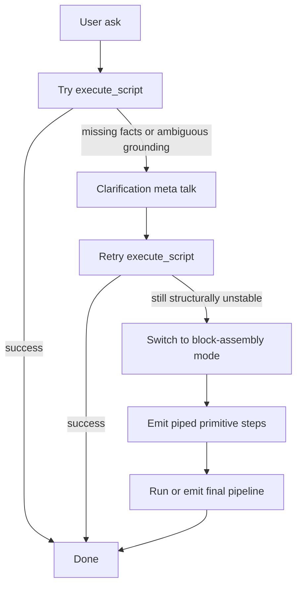

# Store Orchestration Modes

## Purpose

SOP now treats store orchestration as two first-class control surfaces over the same execution substrate.

This is not a provider-specific workaround. It is a provider-neutral reliability strategy for Gemini, ChatGPT, Anthropic, and the generic engine path.

This note is intentionally scoped to **Stores**.

Spaces remain a separate domain with domain-native verbs such as `mint_to_space`, `search_space`, `read_space_config`, `enrich_space`, and vectorization operations. They are currently not being forced into the same join/filter/pipeline model used for deterministic store workflows. Stores-to-Spaces interoperability is expected to grow as a cross-domain orchestration seam, but that is a separate design track.

The motivation is simple:

- Some models can emit a whole multi-step workflow fluently as one `execute_script` call.
- Some models are more reliable when they build the same workflow step by step from smaller piped operations.
- SOP must support both well so the user experience stays strong across model quality levels.

## One Engine, Two Control Surfaces

Both modes converge on the same atomic execution substrate.

### 1. Rich-Plan Mode

Primary tool:

- `execute_script`

Use this when the model can emit one coherent multi-step workflow with grounded joins, filters, and transaction boundaries.

Strengths:

- best UX when the model is fluent
- fewer round trips
- compact expression of branching, loops, and larger orchestrations
- good fit for strong models such as GPT and Claude when schema grounding is already stable

Weaknesses:

- sensitive to AST drift
- sensitive to malformed nested predicate shapes
- sensitive to relation and field-path ambiguity

### 2. Block-Assembly Mode

Primary tools:

- `begin_tx`
- `open_store`
- `scan`
- `filter`
- `join_right`
- `project`
- `sort`
- `limit`
- `commit_tx`
- `rollback_tx`

Use this when the model is more reliable emitting one grounded step at a time and piping each result into the next.

Strengths:

- shorter translation distance from intent to action
- easier to repair one step without regenerating the whole workflow
- better fit for lower-precision or AST-unstable models
- naturally aligned with the engine's internal atomic operations

Weaknesses:

- more turns or more tool calls
- more visible intermediate state management
- less compact for deeply branching logic

## Important Architectural Rule

Block-assembly mode is not a backup engine.

It is the same internal lego-block substrate already used by `execute_script`.

`execute_script` should be understood as a higher-level orchestration envelope over those same atomic operations.

That statement applies to Stores execution. It should not be read as a claim that Spaces must expose the same two-surface execution model.

## Provider-Neutral Policy

This behavior should live above the provider layer.

Providers are responsible for:

- prompt transport
- tool declaration transport
- continuation transport
- response parsing
- optional provider-owned loop mechanics

Shared Ask/ReAct policy is responsible for:

- preferring `execute_script` first when appropriate
- classifying failures
- deciding when to ask a clarification question
- retrying `execute_script` after grounding improves
- switching to block-assembly mode when whole-plan structural instability persists

## Default Escalation Path

The intended Stores policy is:

1. Try `execute_script` first.
2. If the issue is missing facts or ambiguous grounding, enter clarification/meta-talk with the user.
3. Retry `execute_script` with richer grounded input.
4. If the workflow remains structurally unstable, continue in block-assembly mode.

## Failure Classification

The switch should be based on failure shape, not on provider brand.

Stay on `execute_script` when:

- the workflow is mostly valid and only a filter or join slice is malformed
- one more user fact can ground the missing piece
- schema research or relation research is enough to repair the plan

Consider block-assembly mode when:

- whole-plan AST coherence keeps drifting
- repeated repair attempts preserve too little valid structure
- nested predicate/object shapes keep mutating unpredictably
- the model repeatedly fails to emit a stable script even after clarification and grounded research

## User Experience Rule

The system should keep both modes feeling like two dialects of one engine, not two unrelated subsystems.

That means both modes should share:

- `list_stores`-first grounding when schema is uncertain
- the same relation facts
- the same transaction semantics
- the same result piping semantics
- the same normalization and validation rules
- the same user-visible clarification style

## Runtime Bias Guidance

Recommended bias:

- Strong model and coherent workflow: prefer `execute_script`
- Lower-quality model or repeated structural drift: prefer block assembly
- Branching or looping workflow: bias toward `execute_script`
- Simple multi-step read with joins and filters: block assembly is often sufficient and more reliable

## Long-Term Direction

SOP should keep both paths as a well-oiled machine.

The design target is not choosing one winner. The design target is:

- rich-plan mode for compact high-fluency orchestration
- block-assembly mode for robust stepwise orchestration
- shared escalation and recovery rules across all providers

That gives SOP a resilient model interface even when some LLMs are not yet fluent at strict AST generation.
