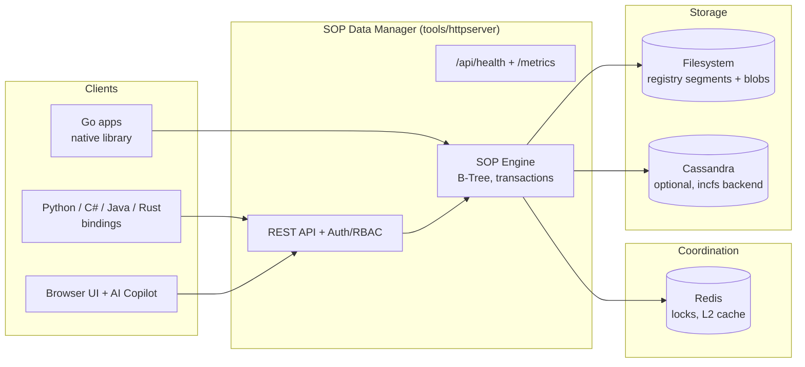
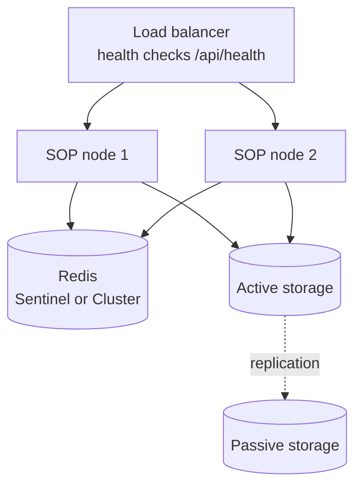
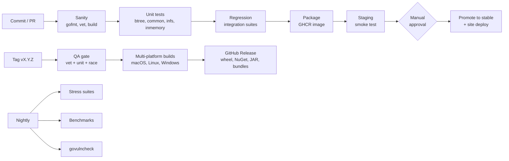

# SOP High Level Design

This document is the operator-facing design overview: how the pieces fit, how the system scales, how it stays up, and how you watch it in production. For code-level detail see [ARCHITECTURE.md](ARCHITECTURE.md), for capacity math see [SCALABILITY.md](SCALABILITY.md), and for runbooks see [OPERATIONS.md](OPERATIONS.md).

## System Context



Backends by use case:

| Backend | Coordination | Storage | Use case |
|---|---|---|---|
| `inmemory` | none | RAM | Tests, embedded, single process |
| `infs` | Redis | Filesystem | Standard production deployment |
| `incfs` | Redis | Cassandra + Filesystem | Existing Cassandra estates |

## Deep Dive: Scalability

The design decouples coordination from storage, so each scales independently.

- Registry segment files shard the UUID-to-physical-location map. Each segment addresses about 49.5M handles; capacity grows by adding segments and stores. Full math in [SCALABILITY.md](SCALABILITY.md).
- Server processes are stateless between transactions. State lives in Redis (locks, cache) and on disk (B-Tree segments), so you scale reads and writes by adding app nodes against shared storage targets.
- Redis is the only shared choke point. It holds short-lived locks and cache entries, not data, so a modest Redis instance coordinates a large fleet. Move to Redis Cluster when lock throughput demands it.
- Large objects stream through `streamingdata` in chunks instead of loading into memory, keeping node memory flat as payload size grows.

## Deep Dive: Reliability

- Transactions are two-phase: writes stage first, then commit atomically through the registry. A crashed writer leaves staged data that rollback cleans up, never a half-committed B-Tree.
- Error handling distinguishes transient from permanent failures. Transient I/O errors retry; permanent drive or filesystem failures trigger failover to the replication target (see [OPERATIONS.md](OPERATIONS.md)).
- Replication: `infs` supports active and passive storage targets. On permanent failure of the active target, SOP reinstates from the passive copy. This path is exercised nightly by the replication stress suite in CI.
- Priority logs let a restarted process recover coordination state after a Redis outage window.

## Deep Dive: High Availability



- Front SOP nodes with a load balancer probing `/api/health`. The endpoint is unauthenticated and returns version plus status, cheap enough for 1s probe intervals.
- Run Redis under Sentinel or Cluster. Start Redis before SOP nodes; the engine treats a missing Redis at startup as a coordination outage, not a data loss event.
- Keep the passive storage target on separate physical media or a separate mount. Failover is automatic on permanent errors; reinstatement is exercised by the `Reinstate_MultiTable_Concurrency_SecondFailover` stress test.
- For `incfs`, Cassandra replication factor covers the storage tier; SOP nodes stay stateless.

## Observability

Three signals ship in the box:

1. Structured logs. The server logs through `log/slog` with key-value context. Every request is logged with method, path, status, and duration; 5xx responses log at error level.
2. Health: `GET /api/health` returns `{"status":"ok","version":...}` for liveness probes and load balancers.
3. Telemetry: `GET /metrics` serves Prometheus text format with zero external dependencies:

| Metric | Type | Meaning |
|---|---|---|
| `sop_build_info{version}` | gauge | Running version |
| `sop_uptime_seconds` | gauge | Seconds since start |
| `sop_http_requests_total` | counter | All requests received |
| `sop_http_responses_total{class}` | counter | Responses by 2xx/3xx/4xx/5xx |
| `sop_http_requests_in_flight` | gauge | Concurrent requests |
| `sop_goroutines` | gauge | Goroutine count |
| `sop_heap_alloc_bytes` | gauge | Live heap bytes |

Alert on: 5xx rate over 1% of responses, in-flight requests trending up without traffic growth (saturation), goroutines climbing monotonically (leak), and health probe failures.

## Delivery Pipeline and QA Gates

Every change passes through tiered gates before it can reach a customer:



Gate summary:

| Tier | When | What it catches |
|---|---|---|
| Sanity | every push/PR | Format drift, vet issues, broken builds |
| Unit | every push/PR | Logic regressions, race conditions |
| Regression | every push/PR | Integration breakage across backends |
| Smoke | every master build | Broken packaged image before staging |
| Release QA gate | every tag | Publishing untested binaries |
| Stress | nightly | Concurrency and failover bugs under load |
| Perf | nightly | Throughput and allocation regressions |
| Vulncheck | nightly | Known CVEs reachable from the code |

CI runs on GitHub Actions. For this repo it beats Jenkins on every axis that matters: hosted runners are free for public repos, GHCR and environment approval gates are native, and there is no controller to patch or agents to babysit. Jenkins earns its keep when builds need self-hosted hardware, private network access, or org-mandated plugins; none apply here.

## Customer Quickstart

Container, two commands:

```bash
docker pull ghcr.io/sharedcode/zeltrin-quickstart:stable
docker run --rm ghcr.io/sharedcode/zeltrin-quickstart:stable
```

Full server from a release bundle, three commands:

```bash
curl -LO https://github.com/SharedCode/zeltrin/releases/latest/download/sop-bundle-linux-amd64.tar.gz
tar xzf sop-bundle-linux-amd64.tar.gz
./sop-bundle/sop-httpserver
```

The server starts in setup mode on first run; point a browser at `http://localhost:8080`, set the data path, and it is ready. Configuration reference: [CONFIGURATION.md](CONFIGURATION.md). Step-by-step walkthrough: [GETTING_STARTED.md](GETTING_STARTED.md).
