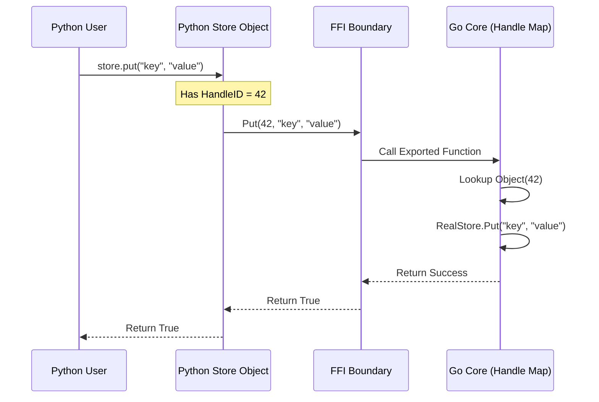

# SOP Architecture & Release Process

This document details the system architecture, build flows, and release procedures for the SOP ecosystem. It is designed to help engineers understand how the "Polyglot" nature of SOP is implemented and maintained.

## 1. System Architecture: The "Hub & Spoke" Model

SOP uses a **Hub and Spoke** architecture to support multiple programming languages without rewriting the core database logic.

### The Hub: Go Core (`bindings/main`)
The "Hub" is the compiled Go code. It encapsulates the entire B-Tree engine, caching, and transaction management.
*   **Build Mode**: `c-shared`
*   **Output**: A C-compatible shared library (`libjsondb.so`, `.dll`, `.dylib`) and a C header file (`libjsondb.h`).
*   **Role**: It acts as a "Black Box" server running inside the host application's process.

### The Spokes: Language Bindings
The "Spokes" are thin wrappers in Python, C#, Java, and Rust. They do not contain database logic. Instead, they marshal data across the Foreign Function Interface (FFI) boundary.

```mermaid
graph TD
    subgraph "Host Application"
        Python[Python App] --> PyBind[Python Binding (ctypes)]
        Java[Java App] --> JBind[Java Binding (JNA)]
        CSharp[C# App] --> CSBind[C# Binding (P/Invoke)]
    end

    subgraph "Shared Memory Space"
        PyBind --> |FFI Call| Lib[libjsondb (Go Core)]
        JBind --> |FFI Call| Lib
        CSBind --> |FFI Call| Lib
    end

    Lib --> |File I/O| Disk[(Disk / Network)]
```

---

## 2. Object-Oriented Design & Mapping

SOP exposes a consistent Object-Oriented API across all languages. This makes it easy for developers to switch languages without relearning the concepts.

### Core Objects
1.  **`StoreFactory`**: The entry point. It manages the lifecycle of the underlying Go resources.
2.  **`Store`**: Represents a single B-Tree. It provides CRUD operations (`Get`, `Put`, `Remove`).
3.  **`Transaction`**: Manages ACID scopes.

### The "Handle" Pattern
Since Go is garbage collected and C/C++ (the FFI layer) is manual, we use a **Handle Pattern** to map objects.

*   **In Go**: A global map `map[int64]interface{}` holds references to active Stores and Transactions.
*   **In Bindings**: The Python/C# object holds a simple `int64` ID (the Handle).
*   **Flow**: When Python calls `store.get()`, it passes the `int64` handle to Go. Go looks up the real object and executes the method.



---

## 3. The Build & Release Flow

The release process is an automated pipeline that transforms source code into platform-specific bundles.

### Flow Diagram

```mermaid
graph LR
    Git[Git Tag v1.0.0] -->|Trigger| GH[GitHub Actions]
    
    subgraph "Build Phase"
        GH -->|1. Compile| Bin[SOP Manager Binary]
        GH -->|2. Cross-Compile| Libs[Shared Libraries (.so/.dll)]
    end
    
    subgraph "Packaging Phase"
        Libs -->|Copy| PyPkg[Python Wheel]
        Libs -->|Copy| NuPkg[NuGet Package]
        Libs -->|Copy| JarPkg[Java JAR]
    end
    
    subgraph "Bundling Phase"
        Bin & PyPkg & NuPkg & JarPkg -->|Zip| Bundle[Platform Bundle]
    end
    
    Bundle -->|Upload| Release[GitHub Release]
```

### Detailed Steps

1.  **Trigger**: A git tag (e.g., `v1.0.0`) is pushed.
2.  **Cross-Compilation (The Hard Part)**:
    *   We use **Zig** (`zig cc`) to compile the Go code into C-Shared libraries for Linux and macOS from a single Ubuntu runner.
    *   We use **MinGW** to compile for Windows.
    *   *Why?* Standard Go cross-compilation (`CGO_ENABLED=1`) is difficult because it requires system headers for the target OS. Zig provides these headers automatically.
3.  **Artifact Generation**:
    *   **Python**: `python -m build` creates a `.whl` containing the `.so/.dylib` file.
    *   **C#**: `dotnet pack` creates a `.nupkg` containing the `.dll` in the `runtimes/` folder.
    *   **Java**: `mvn package` creates a `.jar` with the native libs in `src/main/resources`.
4.  **Bundling**:
    *   We create a "Batteries Included" zip file for each OS. This ensures the user doesn't need to hunt for dependencies.

---

## 4. Maintenance Guide for Engineers

### Adding a New Language
To add support for a new language (e.g., Ruby):

1.  **The Wrapper**: Write a Ruby class that uses `FFI` to load `libjsondb`.
2.  **The Build**: Update `bindings/main/build.sh` to copy the generated shared library to your Ruby project folder.
3.  **The Pipeline**: Update `.github/workflows/release.yml` to package the Ruby gem.

### Updating the API
If you add a new feature to the Go Core (e.g., `Store.GetAdvanced()`):

1.  **Go Side**: Export the function in `bindings/main/exports.go`. Use `//export MyFunction` comment.
2.  **C Header**: Run `go build -buildmode=c-shared` locally to regenerate `libjsondb.h`.
3.  **Bindings Side**:
    *   **Python**: Update `ctypes` signatures in `bindings/python/sop/__init__.py`.
    *   **C#**: Update `DllImport` signatures in `bindings/csharp/Sop/Interop.cs`.
    *   **Java**: Update `JNA` interface in `bindings/java/.../Interop.java`.

---

## 5. How to Release

1.  **Commit**: Ensure `master` is clean.
2.  **Tag**:
    ```bash
    git tag v1.0.2
    git push origin v1.0.2
    ```
3.  **Verify**: Check the [GitHub Releases Page](https://github.com/SharedCode/sop/releases) after ~10 minutes.
