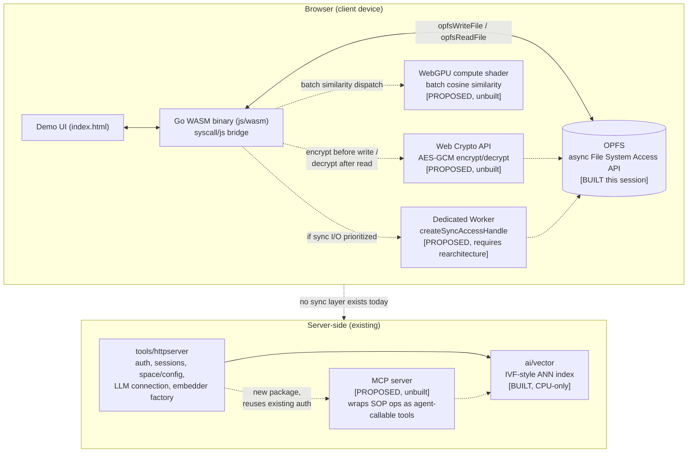

# Strategic Architecture & Investor Moat

A candid technical and business assessment of what it would take to move SOP from a working embedded storage engine toward a local-first, enterprise-defensible platform. This document is a **proposal and feasibility review**, not a status report: it says explicitly, section by section, what already exists in this repository today versus what is unbuilt and why.

If you are looking for what SOP has actually proven so far, read [For Investors](../README.md#-for-investors) in the main README first. This document does not repeat that honesty discipline, it extends it into speculative territory, and marks the line between the two clearly throughout.

---

## 0. What exists today (the baseline this document builds on)

Stated once here so the rest of the document can reference it without re-explaining:

- **Browser runtime**: the WASM demo (`demo/`) compiles with `GOOS=js GOARCH=wasm`, the standard Go compiler's browser target. It talks to the DOM/browser APIs via `syscall/js`, not the Wasm Component Model.
- **Client-side persistence**: as of this session, the demo persists its ledger, vector index, and agent-memory state to Origin Private File System (OPFS) using the async File System Access API (`createWritable`/`getFile`), called from the main thread. This is real and tested (`demo/persistence.go`, `demo/persistence_test.go`, run against headless Chrome via `wasmbrowsertest`). It is **not** the synchronous `createSyncAccessHandle` path, that requires a dedicated Worker and was explicitly scoped out this session to avoid rearchitecting a working demo.
- **Vector search**: `ai/vector` is a real IVF-style approximate nearest-neighbor index (centroid clustering + cosine similarity, see `ai/vector/store.go`), running as ordinary Go code, server-side or in any native Go binary. It is CPU-bound; nothing in this repo currently touches a GPU. The browser demo's vector search is a separate, simpler brute-force cosine implementation over 128-dimension vectors (`demo/main.go`), also CPU-only.
- **HTTP surface**: `tools/httpserver` is a substantial existing REST API (auth, sessions, space/config management, an LLM connection handler, an embedder factory, a summarizer). It has no Model Context Protocol endpoint today, but it's the natural place to add one rather than building a new service from scratch.
- **Encryption**: there is no encryption-at-rest anywhere in this codebase. Data written to OPFS by the demo is plaintext JSON.
- **Sync across devices**: none. Each browser's OPFS storage is local to that browser profile; there is no replication, no CRDT, no event log shipping data between devices.

Everything below this line is proposed, not built, unless explicitly marked otherwise.

---

## 1. Emerging Tech Stack Integration

### 1.1 Wasm Component Model / WASI 0.2

**Honest state of Go tooling first, because this changes the recommendation.** Go's standard toolchain (this repo pins Go 1.26.8) supports two Wasm targets: `js/wasm` (what the browser demo uses) and `wasip1/wasm` (WASI Preview 1). Neither is the Component Model / WASI 0.2. Emitting a real Wasm component from Go today requires third-party tooling on top of the standard compiler, most commonly `wit-bindgen-go` plus the `go.bytecodealliance.org/cm` runtime shim, or TinyGo's component support. This is workable but adds a second toolchain to the CI matrix, it is not a flag on `go build`.

Given that, the Component Model is not the right lever for the *browser* demo, `js/wasm` with `syscall/js` is simpler and already works. Where it's genuinely interesting is a **second, separate target**: SOP's core engine (`btree`, `common`, `fs`) compiled as a portable Wasm component that runs identically inside Fermyon Spin, wasmCloud, or any WASI 0.2 host, sandboxed, capability-scoped, cold-starting in single-digit milliseconds. That's a different product surface (server-side portable compute unit) from the browser demo, and would need its own spike to validate before committing engineering time, specifically: does `wit-bindgen-go` handle the generic-heavy B-Tree code (`btree.Ordered`, `sop.Tuple[K,V]`) without excessive glue, since Go generics and the Component Model's WIT type system don't map 1:1.

### 1.2 OPFS + sync access handles

The async path is live (see §0). The synchronous `createSyncAccessHandle` path is real and would deliver meaningfully lower write latency, but it has a hard requirement: it only works inside a dedicated Worker. Moving the WASM binary into a Worker means every one of the ~11 `sopX()` functions the demo currently registers on `js.Global()` (`sopRunTransaction`, `sopAgentStart`, etc.) has to become an async `postMessage`/`onmessage` round trip in `index.html`, instead of a direct synchronous call. That's a real rearchitecture, correctly deferred this session, and the concrete next step if this path is prioritized: prototype it in a throwaway branch against just `sopRunTransaction` first, measure the actual latency delta against the current async-on-main-thread numbers, and decide if it's worth the calling-convention rewrite across the rest of the demo before doing it for real.

### 1.3 WebGPU for local vector inference

Genuinely buildable, using the same technique this session just proved out for OPFS: bridge a browser API into Go via `syscall/js`, using the promise-await-via-channel pattern already implemented in `demo/persistence.go` (`awaitPromise`). A WebGPU compute shader batch-computing cosine similarity or centroid distance across `ai/vector`'s existing vector layout is a real, scoped project: define a WGSL compute shader, bridge `navigator.gpu.requestAdapter()`/`requestDevice()`, upload query + candidate vectors as a `GPUBuffer`, dispatch, read back results.

**Honest caveat**: WebGPU is shipped and stable in Chrome/Edge since 2023, has partial support in Safari (17.4+), and is behind a flag or unavailable in some Firefox channels depending on version. Any implementation needs the same feature-detect-and-fall-back-to-CPU discipline the OPFS work this session already established (`opfsAvailable()` in `demo/persistence.go` is the existing pattern to follow). This is not a "just works everywhere" primitive yet.

### 1.4 Agentic & Protocol Interoperability (MCP)

No MCP server exists in this repo. The realistic path is a new package (e.g., `tools/mcpserver`) that reuses `tools/httpserver`'s existing auth and session infrastructure rather than duplicating it, exposing SOP operations (read a record, run a query, validate a schema, execute a defined procedure) as MCP tools with a JSON schema per tool, matching the MCP spec's tool-call contract. This turns SOP from "a datastore you query" into "a datastore an agent can be handed as a tool," which is a real, meaningful capability if there's a customer need for it. It is unbuilt; scoping it precisely (which SOP operations become MCP tools, what auth model applies to an agent instead of a human user) is a design task on its own, not something to hand-wave in an architecture doc.

---

## 2. Enterprise Moat & Data Sovereignty Architecture

### 2.1 The mechanism, stated honestly

If operational data is written to OPFS and never transmitted to a server, then a large category of standard security-review questions (where does our data live, who can access the underlying storage, what happens on a data breach at your infrastructure provider) get a structurally different answer than a conventional multi-tenant SaaS gets: the honest answer becomes "we never received it." That's a real, defensible architectural property, not a marketing claim, *if and only if* it's actually true end-to-end (see the encryption gap immediately below).

### 2.2 What's missing to make this a real claim: zero-knowledge encryption

Nothing in this repo encrypts data before writing it to OPFS today (see §0). The concrete spec to close that gap:

1. Derive a key client-side via the Web Crypto API (`crypto.subtle.deriveKey`, PBKDF2 or Argon2-via-WASM from a user passphrase, or a WebAuthn-backed key for a stronger UX).
2. Encrypt the JSON snapshot with AES-GCM (`crypto.subtle.encrypt`) before the `opfsWriteFile` call already implemented this session; decrypt after `opfsReadFile`, before `json.Unmarshal`.
3. The key never leaves the browser and is never sent to any server SOP operates, that's what makes it zero-knowledge rather than merely "encrypted in transit."

This is a bounded, well-understood piece of engineering (the Web Crypto API is standard, stable, and doesn't need feature-detection fallbacks the way OPFS/WebGPU do). The **product tradeoff** that has to be decided before building it: if the key is derived purely client-side with no server-side escrow, a user who loses their passphrase loses their data, permanently, with no recovery path. That's the correct security property and also a real support-burden and UX decision that needs an explicit answer (recovery codes? no recovery, by design, and say so clearly to users?) before shipping, not after.

### 2.3 What this does and doesn't unlock

**Honest framing, not a specific timeline claim**: an architecture where raw customer data structurally never reaches a vendor's infrastructure removes questions from a security review, it does not by itself grant HIPAA, SOC 2, or GDPR compliance. Those frameworks require organizational controls (access logging, incident response process, data processing agreements, breach notification procedures, in HIPAA's case a signed BAA) that exist independently of where the bytes are physically stored. The correct claim is "this architecture removes an entire category of data-residency risk from the conversation," not "this makes us compliant." Overstating this specific point to an enterprise security team is the kind of claim that gets caught in diligence and damages credibility with the exact audience it's meant to reassure.

---

## 3. Business Model & Investor Pitch Narrative

### 3.1 The COGS mechanism, without invented numbers

The real mechanical claim: if indexing, embedding computation, and query execution happen in the client's browser via Wasm instead of on a server SOP operates, then SOP's marginal infrastructure cost per active user drops, because the expensive part (compute and storage I/O) is no longer something SOP pays for per-user. That's a real, sound argument for *why* gross margins would structurally improve versus a conventional server-side SaaS doing the same work.

**What this document will not do**: state a specific target margin percentage (e.g., "85-90%"), a specific NRR figure, or a specific sales-cycle compression number (e.g., "9 months to weeks"). SOP has no paying customers, no measured COGS, and no sales pipeline today (see the README's own [What Has Not Yet Been Proven](../README.md#-for-investors) section). Any specific percentage in a pitch deck without underlying usage data to support it is a number a diligent investor will ask to see the model behind, and there isn't one yet. The mechanism is real and worth pitching; the number attached to it should come from an actual pilot deployment's actual measured infrastructure spend, not a projection with no data behind it.

### 3.2 "Why Now"

Three real, externally verifiable industry dynamics, not SOP-specific claims:

- OPFS reached Baseline-available status across major browsers in 2023, meaning the primitive this whole document depends on is now something you can rely on without an origin trial or a flag.
- WebGPU shipped stable in Chrome and Edge in 2023, meaning client-side GPU compute is now a real target for production code, not an experimental one.
- Rising cloud inference and storage costs are a widely reported industry pressure pushing more vendors to look at local-first architectures as a cost lever, this is a general market observation, not a SOP-specific data point.

### 3.3 Monetization shape (directional, not committed)

A local-first architecture is a genuinely better fit for outcome-based or seat-plus-governance pricing than pure seat licensing, because the vendor's marginal cost per seat is low and mostly independent of usage intensity, which makes usage-based pricing viable without the vendor eating the cost of heavy users. This is a reasonable direction to explore once there's a design partner to validate it against, it is not something to commit to in a pitch before any customer has used the product.

---

## 4. Architecture Diagram

Current state (solid) versus proposed additions (dashed) from §1-2:

---

## 5. Candid Critique & Failure Modes

Ranked by how likely each is to actually bite, not by section order above.

1. **OPFS storage eviction.** Browsers can evict *non-persistent* origin storage under disk pressure. `navigator.storage.persist()` requests durable storage, but it is not automatically granted (that's up to the browser's own heuristics). This was a real gap in the initial OPFS implementation, flagged as a bug rather than a roadmap item, and fixed in the same pass as writing this document: `demo/index.html` now calls `navigator.storage.persist()` at boot. It's fire-and-forget and best-effort by design (a rejection doesn't block anything), the browser can still decline. That's the honest ceiling of what a web origin can guarantee here, there is no API for a page to force persistent storage.

2. **No cross-device sync.** Everything built this session is single-browser-profile local. A user who opens the demo on a second device or in a different browser profile sees none of their prior state, this is not currently pitched as multi-device and shouldn't be until it's true. Making it true requires either a CRDT-based merge layer or an event-sourcing log shipped through a server SOP operates, at which point the "your data never touches our servers" claim from §2 needs to be re-examined for whatever that sync layer does touch (does it see plaintext, or only encrypted blobs it can't read? that's a real design decision, not a detail).

3. **WASI 0.2 tooling immaturity for Go specifically.** Covered in §1.1: this is not a "coming soon, minor version bump" gap, it's a genuinely separate toolchain with its own maturity risk, particularly around how well it handles this codebase's generic-heavy types. Don't commit to a timeline on this without a real spike first.

4. **WebGPU fragmentation.** Covered in §1.3. Any pitch of this capability needs to say "where supported" every time, not present it as universal.

5. **Zero-knowledge encryption's recovery tradeoff.** Covered in §2.2. This is a product decision with real support-cost consequences, not a pure engineering task, and needs a named owner and an explicit answer before it ships, not an implicit one.

6. **Compliance overclaim risk.** Covered in §2.3. This is the single highest-risk failure mode in this entire document if it reaches an enterprise buyer's security team: claiming an architectural property equals a compliance certification is the kind of statement that gets caught immediately by anyone who actually runs security reviews for a living, and it costs more credibility than the accurate, narrower claim would have gained.

7. **MCP as an attack surface.** Exposing SOP operations to an external agent over MCP means an agent, not a human, is now an authenticated actor with the ability to read and potentially write operational data. That needs its own threat model (can a compromised or misconfigured agent exfiltrate everything a human user could access? what's the blast radius of an over-scoped tool grant?) before it ships, it is not a detail to defer past the initial design.
